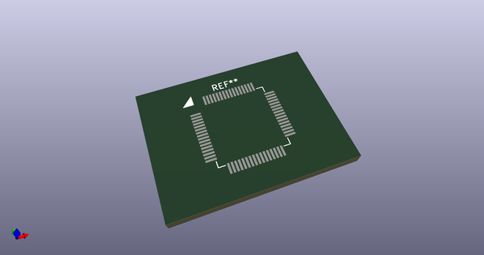
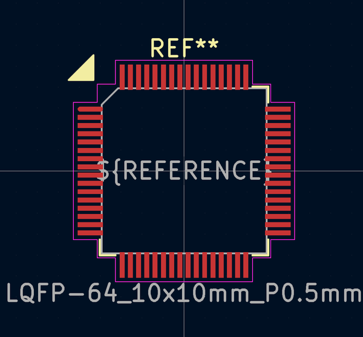
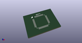
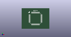

# OOMP Footprint  
## LQFP-64_10x10mm_P0.5mm  by AcheronProject  
  
oomp key: oomp_acheronproject_acheron_components_lqfp_64_10x10mm_p0_5mm  
  
source repo at: [http://github.com/AcheronProject/acheron_Components.pretty/blob/master/tmp/data/oomlout_oomp_footprint_src/VQFN-16-1EP_3x3mm_P0.5mm_EP1.6x1.6mm.kicad_mod](http://github.com/AcheronProject/acheron_Components.pretty/blob/master/tmp/data/oomlout_oomp_footprint_src/VQFN-16-1EP_3x3mm_P0.5mm_EP1.6x1.6mm.kicad_mod)  
## Footprint  
  
  
  
  
| name | value | 
| --- | --- | 
| footprint name | LQFP-64_10x10mm_P0.5mm | 
| footprint description | LQFP, 64 Pin (https://www.analog.com/media/en/technical-documentation/data-sheets/ad7606_7606-6_7606-4.pdf), generated with kicad-footprint-generator ipc_gullwing_generator.py | 
| number of pads | 64 | 
| github path | http://github.com/AcheronProject/acheron_Components.pretty/blob/master/tmp/data/oomlout_oomp_footprint_src/LQFP-64_10x10mm_P0.5mm.kicad_mod | 
| oomp key | oomp_acheronproject_acheron_components_lqfp_64_10x10mm_p0_5mm | 
| oomp bot github | https://github.com/oomlout/oomlout_oomp_footprint_bot/tree/main/tmp/data/oomlout_oomp_footprint_src/footprints/acheronproject_acheron_components_lqfp_64_10x10mm_p0_5mm/working | 
## Images  
  
  
  
  
  
  
  
  
