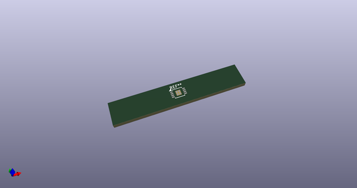
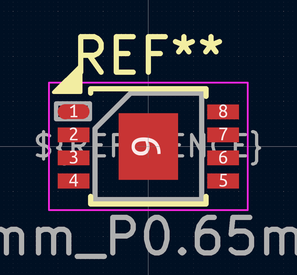
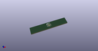

# OOMP Footprint  
## MSOP-8-1EP_3x3mm_P0.65mm_EP1.68x1.88mm  by AcheronProject  
  
oomp key: oomp_acheronproject_acheron_components_msop_8_1ep_3x3mm_p0_65mm_ep1_68x1_88mm  
  
source repo at: [http://github.com/AcheronProject/acheron_Components.pretty/blob/master/tmp/data//oomlout_oomp_footprint_src/VQFN-16-1EP_3x3mm_P0.5mm_EP1.6x1.6mm.kicad_mod](http://github.com/AcheronProject/acheron_Components.pretty/blob/master/tmp/data//oomlout_oomp_footprint_src/VQFN-16-1EP_3x3mm_P0.5mm_EP1.6x1.6mm.kicad_mod)  
## Footprint  
  
  
  
  
| name | value | 
| --- | --- | 
| footprint name | MSOP-8-1EP_3x3mm_P0.65mm_EP1.68x1.88mm | 
| footprint description | MS8E Package; 8-Lead Plastic MSOP, Exposed Die Pad (see Linear Technology 05081662_K_MS8E.pdf) | 
| number of pads | 13 | 
| github path | http://github.com/AcheronProject/acheron_Components.pretty/blob/master/tmp/data//oomlout_oomp_footprint_src/MSOP-8-1EP_3x3mm_P0.65mm_EP1.68x1.88mm.kicad_mod | 
| oomp key | oomp_acheronproject_acheron_components_msop_8_1ep_3x3mm_p0_65mm_ep1_68x1_88mm | 
| oomp bot github | https://github.com/oomlout/oomlout_oomp_footprint_bot/tree/main/tmp/data//oomlout_oomp_footprint_src/footprints/acheronproject_acheron_components_msop_8_1ep_3x3mm_p0_65mm_ep1_68x1_88mm/working | 
## Images  
  
  
  
  
  
  
  
  
