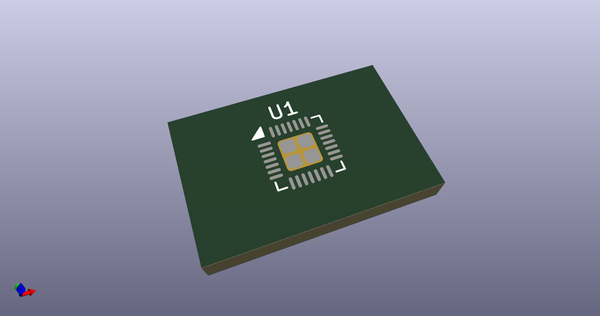

# OOMP Footprint  
## QFN-28-1EP_4x4mm_P0.4mm_EP2.3x2.3mm  by AcheronProject  
  
oomp key: oomp_acheronproject_acheron_components_qfn_28_1ep_4x4mm_p0_4mm_ep2_3x2_3mm  
  
source repo at: [http://github.com/AcheronProject/acheron_Components.pretty/blob/master/tmp/data//oomlout_oomp_footprint_src/VQFN-16-1EP_3x3mm_P0.5mm_EP1.6x1.6mm.kicad_mod](http://github.com/AcheronProject/acheron_Components.pretty/blob/master/tmp/data//oomlout_oomp_footprint_src/VQFN-16-1EP_3x3mm_P0.5mm_EP1.6x1.6mm.kicad_mod)  
## Footprint  
  
  
  
  
| name | value | 
| --- | --- | 
| footprint name | QFN-28-1EP_4x4mm_P0.4mm_EP2.3x2.3mm | 
| footprint description | QFN, 28 Pin (http://www.issi.com/WW/pdf/31FL3731.pdf#page=21), generated with kicad-footprint-generator ipc_noLead_generator.py | 
| number of pads | 33 | 
| github path | http://github.com/AcheronProject/acheron_Components.pretty/blob/master/tmp/data//oomlout_oomp_footprint_src/QFN-28-1EP_4x4mm_P0.4mm_EP2.3x2.3mm.kicad_mod | 
| oomp key | oomp_acheronproject_acheron_components_qfn_28_1ep_4x4mm_p0_4mm_ep2_3x2_3mm | 
| oomp bot github | https://github.com/oomlout/oomlout_oomp_footprint_bot/tree/main/tmp/data//oomlout_oomp_footprint_src/footprints/acheronproject_acheron_components_qfn_28_1ep_4x4mm_p0_4mm_ep2_3x2_3mm/working | 
## Images  
  
  
  
  
  
  
  
  
