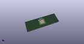

# OOMP Footprint  
## QFN-44-1EP_7x7mm_P0.5mm_EP5.2x5.2mm  by AcheronProject  
  
oomp key: oomp_acheronproject_acheron_components_qfn_44_1ep_7x7mm_p0_5mm_ep5_2x5_2mm  
  
source repo at: [http://github.com/AcheronProject/acheron_Components.pretty/blob/master/tmp/data/oomlout_oomp_footprint_src/VQFN-16-1EP_3x3mm_P0.5mm_EP1.6x1.6mm.kicad_mod](http://github.com/AcheronProject/acheron_Components.pretty/blob/master/tmp/data/oomlout_oomp_footprint_src/VQFN-16-1EP_3x3mm_P0.5mm_EP1.6x1.6mm.kicad_mod)  
## Footprint  
  
  
  
  
| name | value | 
| --- | --- | 
| footprint name | QFN-44-1EP_7x7mm_P0.5mm_EP5.2x5.2mm | 
| footprint description | QFN, 44 Pin (http://ww1.microchip.com/downloads/en/DeviceDoc/2512S.pdf#page=17), generated with kicad-footprint-generator ipc_dfn_qfn_generator.py | 
| number of pads | 61 | 
| github path | http://github.com/AcheronProject/acheron_Components.pretty/blob/master/tmp/data/oomlout_oomp_footprint_src/QFN-44-1EP_7x7mm_P0.5mm_EP5.2x5.2mm.kicad_mod | 
| oomp key | oomp_acheronproject_acheron_components_qfn_44_1ep_7x7mm_p0_5mm_ep5_2x5_2mm | 
| oomp bot github | https://github.com/oomlout/oomlout_oomp_footprint_bot/tree/main/tmp/data/oomlout_oomp_footprint_src/footprints/acheronproject_acheron_components_qfn_44_1ep_7x7mm_p0_5mm_ep5_2x5_2mm/working | 
## Images  
  
  
  
  
  
  
  
  
