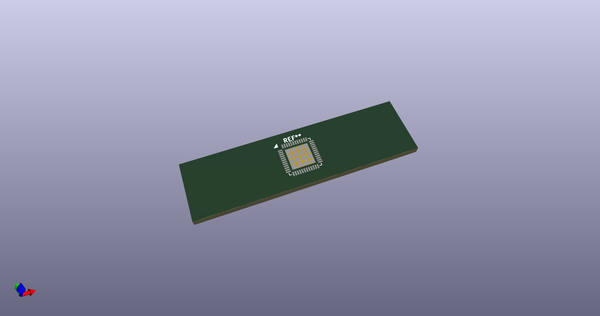
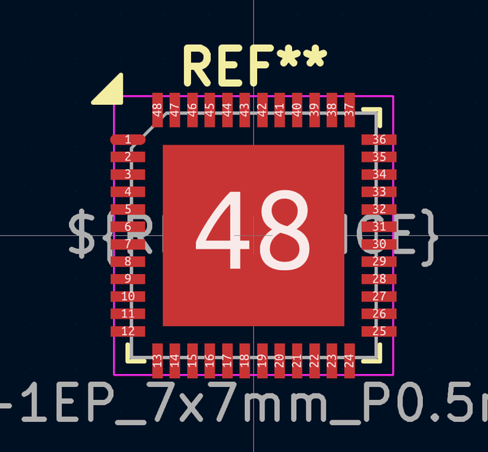
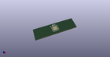

# OOMP Footprint  
## STM_UFQFPN-48-1EP_7x7mm_P0.5mm_HandSoldering  by AcheronProject  
  
oomp key: oomp_acheronproject_acheron_components_stm_ufqfpn_48_1ep_7x7mm_p0_5mm_handsoldering  
  
source repo at: [http://github.com/AcheronProject/acheron_Components.pretty/blob/master/tmp/data//oomlout_oomp_footprint_src/VQFN-16-1EP_3x3mm_P0.5mm_EP1.6x1.6mm.kicad_mod](http://github.com/AcheronProject/acheron_Components.pretty/blob/master/tmp/data//oomlout_oomp_footprint_src/VQFN-16-1EP_3x3mm_P0.5mm_EP1.6x1.6mm.kicad_mod)  
## Footprint  
  
  
  
  
| name | value | 
| --- | --- | 
| footprint name | STM_UFQFPN-48-1EP_7x7mm_P0.5mm_HandSoldering | 
| footprint description | QFN, 48 Pin (http://www.thatcorp.com/datashts/THAT_626x_Datasheet.pdf), generated with kicad-footprint-generator ipc_noLead_generator.py | 
| number of pads | 65 | 
| github path | http://github.com/AcheronProject/acheron_Components.pretty/blob/master/tmp/data//oomlout_oomp_footprint_src/STM_UFQFPN-48-1EP_7x7mm_P0.5mm_HandSoldering.kicad_mod | 
| oomp key | oomp_acheronproject_acheron_components_stm_ufqfpn_48_1ep_7x7mm_p0_5mm_handsoldering | 
| oomp bot github | https://github.com/oomlout/oomlout_oomp_footprint_bot/tree/main/tmp/data//oomlout_oomp_footprint_src/footprints/acheronproject_acheron_components_stm_ufqfpn_48_1ep_7x7mm_p0_5mm_handsoldering/working | 
## Images  
  
  
  
  
  
  
  
  
