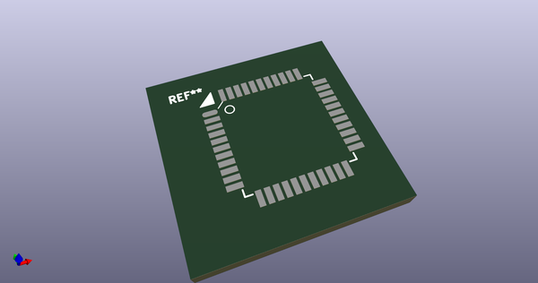
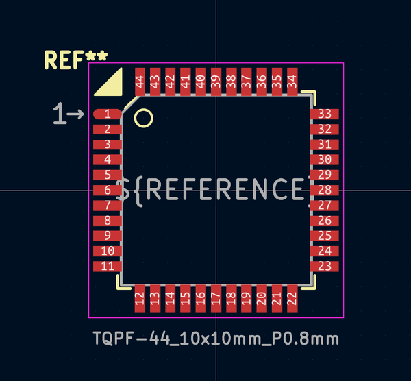
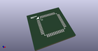
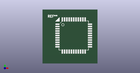

# OOMP Footprint  
## TQPF-44_10x10mm_P0.8mm  by none  
  
oomp key: oomp_acheronproject_acheron_components_tqpf_44_10x10mm_p0_8mm  
  
source repo at: [http://gitlab.com/AcheronProject/acheron_Components.pretty/blob/master/tmp/data//oomlout_oomp_footprint_src/VQFN-16-1EP_3x3mm_P0.5mm_EP1.6x1.6mm.kicad_mod](http://gitlab.com/AcheronProject/acheron_Components.pretty/blob/master/tmp/data//oomlout_oomp_footprint_src/VQFN-16-1EP_3x3mm_P0.5mm_EP1.6x1.6mm.kicad_mod)  
## Footprint  
  
  
  
  
| name | value | 
| --- | --- | 
| footprint name | TQPF-44_10x10mm_P0.8mm | 
| footprint description | 44-Lead Plastic Thin Quad Flatpack (PT) - 10x10x1.0 mm Body [TQFP] (see Microchip Packaging Specification 00000049BS.pdf) | 
| number of pads | 44 | 
| github path | http://github.com/AcheronProject/acheron_Components.pretty/blob/master/tmp/data//oomlout_oomp_footprint_src/TQPF-44_10x10mm_P0.8mm.kicad_mod | 
| oomp key | oomp_acheronproject_acheron_components_tqpf_44_10x10mm_p0_8mm | 
| oomp bot github | https://github.com/oomlout/oomlout_oomp_footprint_bot/tree/main/tmp/data//oomlout_oomp_footprint_src/footprints/acheronproject_acheron_components_tqpf_44_10x10mm_p0_8mm/working | 
## Images  
  
  
  
  
  
  
  
  
