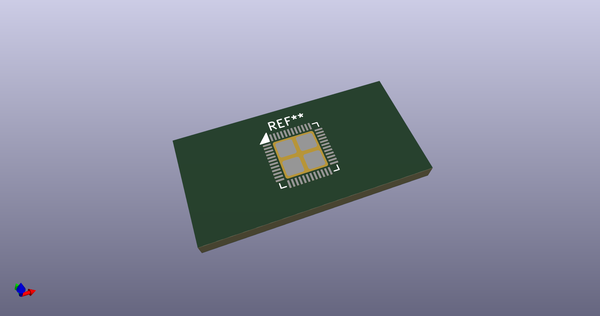
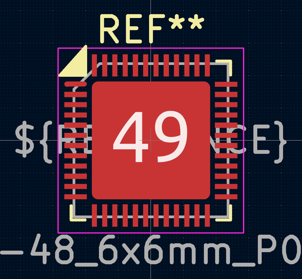
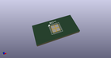

# OOMP Footprint  
## UQFN-48-1EP_6x6mm_P0.4mm_EP4.62x4.62mm  by AcheronProject  
  
oomp key: oomp_acheronproject_acheron_components_uqfn_48_1ep_6x6mm_p0_4mm_ep4_62x4_62mm  
  
source repo at: [http://github.com/AcheronProject/acheron_Components.pretty/blob/master/tmp/data/oomlout_oomp_footprint_src/VQFN-16-1EP_3x3mm_P0.5mm_EP1.6x1.6mm.kicad_mod](http://github.com/AcheronProject/acheron_Components.pretty/blob/master/tmp/data/oomlout_oomp_footprint_src/VQFN-16-1EP_3x3mm_P0.5mm_EP1.6x1.6mm.kicad_mod)  
## Footprint  
  
  
  
  
| name | value | 
| --- | --- | 
| footprint name | UQFN-48-1EP_6x6mm_P0.4mm_EP4.62x4.62mm | 
| footprint description | UQFN, 48 Pin (https://github.com/KiCad/kicad-symbols/pull/1189#issuecomment-449506354), generated with kicad-footprint-generator ipc_dfn_qfn_generator.py | 
| number of pads | 53 | 
| github path | http://github.com/AcheronProject/acheron_Components.pretty/blob/master/tmp/data/oomlout_oomp_footprint_src/UQFN-48-1EP_6x6mm_P0.4mm_EP4.62x4.62mm.kicad_mod | 
| oomp key | oomp_acheronproject_acheron_components_uqfn_48_1ep_6x6mm_p0_4mm_ep4_62x4_62mm | 
| oomp bot github | https://github.com/oomlout/oomlout_oomp_footprint_bot/tree/main/tmp/data/oomlout_oomp_footprint_src/footprints/acheronproject_acheron_components_uqfn_48_1ep_6x6mm_p0_4mm_ep4_62x4_62mm/working | 
## Images  
  
  
  
  
  
  
  
  
