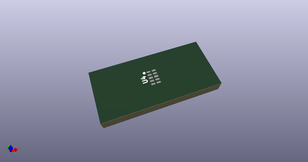
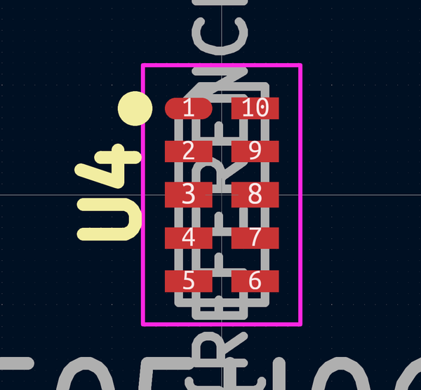
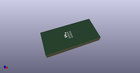

# OOMP Footprint  
## USON-10_2.5x1.0mm_P0.5mm  by none  
  
oomp key: oomp_acheronproject_acheron_components_uson_10_2_5x1_0mm_p0_5mm  
  
source repo at: [http://gitlab.com/AcheronProject/acheron_Components.pretty/blob/master/tmp/data//oomlout_oomp_footprint_src/VQFN-16-1EP_3x3mm_P0.5mm_EP1.6x1.6mm.kicad_mod](http://gitlab.com/AcheronProject/acheron_Components.pretty/blob/master/tmp/data//oomlout_oomp_footprint_src/VQFN-16-1EP_3x3mm_P0.5mm_EP1.6x1.6mm.kicad_mod)  
## Footprint  
  
  
  
  
| name | value | 
| --- | --- | 
| footprint name | USON-10_2.5x1.0mm_P0.5mm | 
| footprint description | USON-10 2.5x1.0mm_ Pitch 0.5mm http://www.ti.com/lit/ds/symlink/tpd4e02b04.pdf | 
| number of pads | 10 | 
| github path | http://github.com/AcheronProject/acheron_Components.pretty/blob/master/tmp/data//oomlout_oomp_footprint_src/USON-10_2.5x1.0mm_P0.5mm.kicad_mod | 
| oomp key | oomp_acheronproject_acheron_components_uson_10_2_5x1_0mm_p0_5mm | 
| oomp bot github | https://github.com/oomlout/oomlout_oomp_footprint_bot/tree/main/tmp/data//oomlout_oomp_footprint_src/footprints/acheronproject_acheron_components_uson_10_2_5x1_0mm_p0_5mm/working | 
## Images  
  
  
  
  
  
  
  
  
