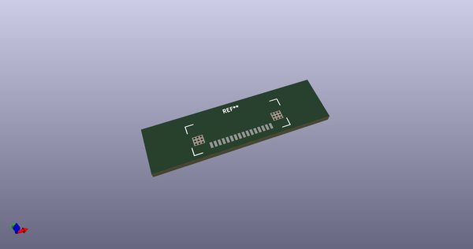
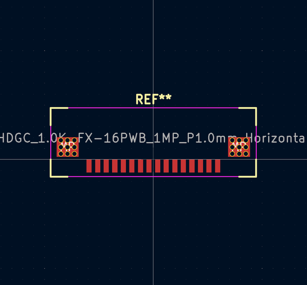
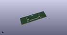
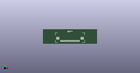

# OOMP Footprint  
## HDGC_1.0K-FX-16PWB_1MP_P1.0mm_Horizontal  by AcheronProject  
  
oomp key: oomp_acheronproject_acheron_connectors_hdgc_1_0k_fx_16pwb_1mp_p1_0mm_horizontal  
  
source repo at: [http://github.com/AcheronProject/acheron_Connectors.pretty/blob/master/tmp/data//oomlout_oomp_footprint_src/XFCN_F1004-H-16-20G-R_P1.0mm_MountingReliefs.kicad_mod](http://github.com/AcheronProject/acheron_Connectors.pretty/blob/master/tmp/data//oomlout_oomp_footprint_src/XFCN_F1004-H-16-20G-R_P1.0mm_MountingReliefs.kicad_mod)  
## Footprint  
  
  
  
  
| name | value | 
| --- | --- | 
| footprint name | HDGC_1.0K-FX-16PWB_1MP_P1.0mm_Horizontal | 
| footprint description | None | 
| number of pads | 38 | 
| github path | http://github.com/AcheronProject/acheron_Connectors.pretty/blob/master/tmp/data//oomlout_oomp_footprint_src/HDGC_1.0K-FX-16PWB_1MP_P1.0mm_Horizontal.kicad_mod | 
| oomp key | oomp_acheronproject_acheron_connectors_hdgc_1_0k_fx_16pwb_1mp_p1_0mm_horizontal | 
| oomp bot github | https://github.com/oomlout/oomlout_oomp_footprint_bot/tree/main/tmp/data//oomlout_oomp_footprint_src/footprints/acheronproject_acheron_connectors_hdgc_1_0k_fx_16pwb_1mp_p1_0mm_horizontal/working | 
## Images  
  
  
  
  
  
  
  
  
