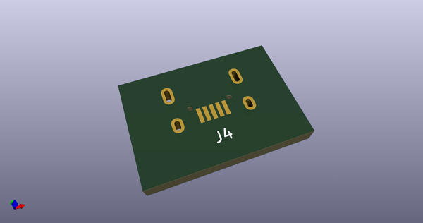
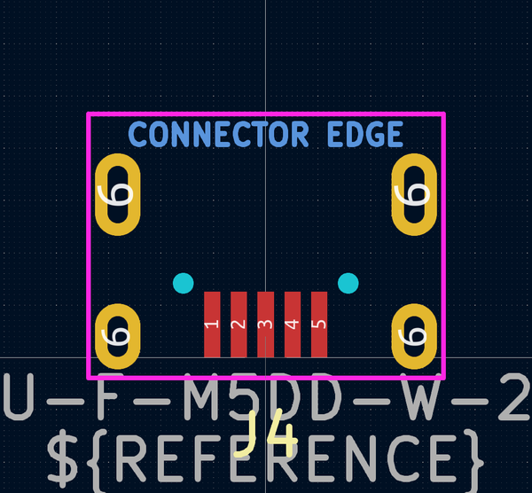
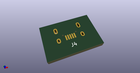
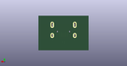
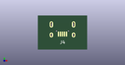

# OOMP Footprint  
## Korean-Hroparts_ U-F-M5DD-W-2  by AcheronProject  
  
oomp key: oomp_acheronproject_acheron_connectors_korean_hroparts_u_f_m5dd_w_2  
  
source repo at: [http://github.com/AcheronProject/acheron_Connectors.pretty/blob/master/tmp/data//oomlout_oomp_footprint_src/XFCN_F1004-H-16-20G-R_P1.0mm_MountingReliefs.kicad_mod](http://github.com/AcheronProject/acheron_Connectors.pretty/blob/master/tmp/data//oomlout_oomp_footprint_src/XFCN_F1004-H-16-20G-R_P1.0mm_MountingReliefs.kicad_mod)  
## Footprint  
  
  
  
  
| name | value | 
| --- | --- | 
| footprint name | Korean-Hroparts_ U-F-M5DD-W-2 | 
| footprint description | USB mini-B connector with THT mounting and SMD pins | 
| number of pads | 11 | 
| github path | http://github.com/AcheronProject/acheron_Connectors.pretty/blob/master/tmp/data//oomlout_oomp_footprint_src/Korean-Hroparts_ U-F-M5DD-W-2.kicad_mod | 
| oomp key | oomp_acheronproject_acheron_connectors_korean_hroparts_u_f_m5dd_w_2 | 
| oomp bot github | https://github.com/oomlout/oomlout_oomp_footprint_bot/tree/main/tmp/data//oomlout_oomp_footprint_src/footprints/acheronproject_acheron_connectors_korean_hroparts_u_f_m5dd_w_2/working | 
## Images  
  
  
  
  
  
  
  
  
