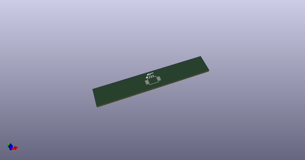
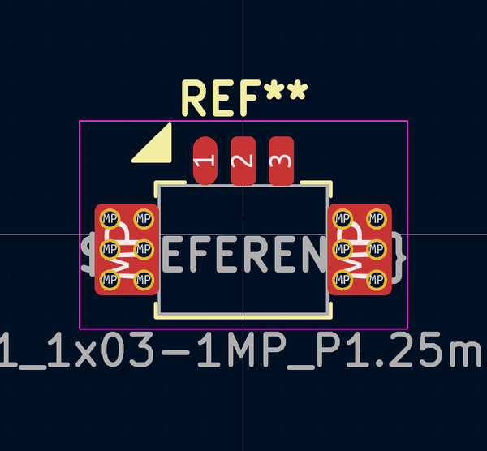
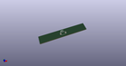

# OOMP Footprint  
## Molex_PicoBlade_53261-0371_1x03-1MP_P1.25mm_Horizontal_MountingReliefs  by AcheronProject  
  
oomp key: oomp_acheronproject_acheron_connectors_molex_picoblade_53261_0371_1x03_1mp_p1_25mm_horizontal_mountingreliefs  
  
source repo at: [http://github.com/AcheronProject/acheron_Connectors.pretty/blob/master/tmp/data/oomlout_oomp_footprint_src/XFCN_F1004-H-16-20G-R_P1.0mm_MountingReliefs.kicad_mod](http://github.com/AcheronProject/acheron_Connectors.pretty/blob/master/tmp/data/oomlout_oomp_footprint_src/XFCN_F1004-H-16-20G-R_P1.0mm_MountingReliefs.kicad_mod)  
## Footprint  
  
  
  
  
| name | value | 
| --- | --- | 
| footprint name | Molex_PicoBlade_53261-0371_1x03-1MP_P1.25mm_Horizontal_MountingReliefs | 
| footprint description | Molex PicoBlade series connector, 53261-0371 (http://www.molex.com/pdm_docs/sd/532610271_sd.pdf), generated with kicad-footprint-generator | 
| number of pads | 19 | 
| github path | http://github.com/AcheronProject/acheron_Connectors.pretty/blob/master/tmp/data/oomlout_oomp_footprint_src/MOLEX_PicoBlade_53261-0371_1x03-1MP_P1.25mm_Horizontal_MountingReliefs.kicad_mod | 
| oomp key | oomp_acheronproject_acheron_connectors_molex_picoblade_53261_0371_1x03_1mp_p1_25mm_horizontal_mountingreliefs | 
| oomp bot github | https://github.com/oomlout/oomlout_oomp_footprint_bot/tree/main/tmp/data/oomlout_oomp_footprint_src/footprints/acheronproject_acheron_connectors_molex_picoblade_53261_0371_1x03_1mp_p1_25mm_horizontal_mountingreliefs/working | 
## Images  
  
  
  
  
  
  
  
  
