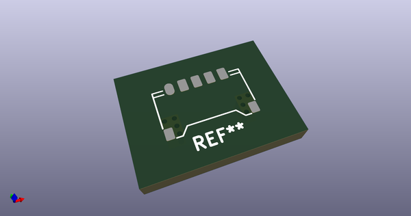
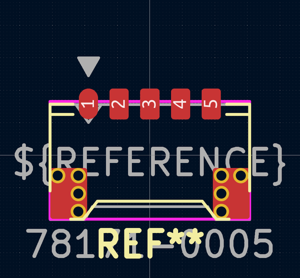
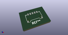
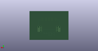
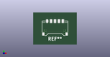

# OOMP Footprint  
## MOLEX_PicoEZMate_781710005-Reinforced-Lite  by AcheronProject  
  
oomp key: oomp_acheronproject_acheron_connectors_molex_picoezmate_781710005_reinforced_lite  
  
source repo at: [http://github.com/AcheronProject/acheron_Connectors.pretty/blob/master/tmp/data/oomlout_oomp_footprint_src/XFCN_F1004-H-16-20G-R_P1.0mm_MountingReliefs.kicad_mod](http://github.com/AcheronProject/acheron_Connectors.pretty/blob/master/tmp/data/oomlout_oomp_footprint_src/XFCN_F1004-H-16-20G-R_P1.0mm_MountingReliefs.kicad_mod)  
## Footprint  
  
  
  
  
| name | value | 
| --- | --- | 
| footprint name | MOLEX_PicoEZMate_781710005-Reinforced-Lite | 
| footprint description | Molex Pico-EZmate series connector, 78171-0004 (http://www.molex.com/pdm_docs/sd/781710002_sd.pdf), generated with kicad-footprint-generator | 
| number of pads | 19 | 
| github path | http://github.com/AcheronProject/acheron_Connectors.pretty/blob/master/tmp/data/oomlout_oomp_footprint_src/MOLEX_PicoEZMate_781710005-Reinforced-Lite.kicad_mod | 
| oomp key | oomp_acheronproject_acheron_connectors_molex_picoezmate_781710005_reinforced_lite | 
| oomp bot github | https://github.com/oomlout/oomlout_oomp_footprint_bot/tree/main/tmp/data/oomlout_oomp_footprint_src/footprints/acheronproject_acheron_connectors_molex_picoezmate_781710005_reinforced_lite/working | 
## Images  
  
  
  
  
  
  
  
  
