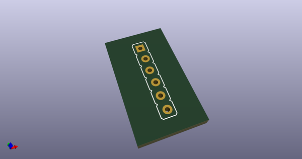
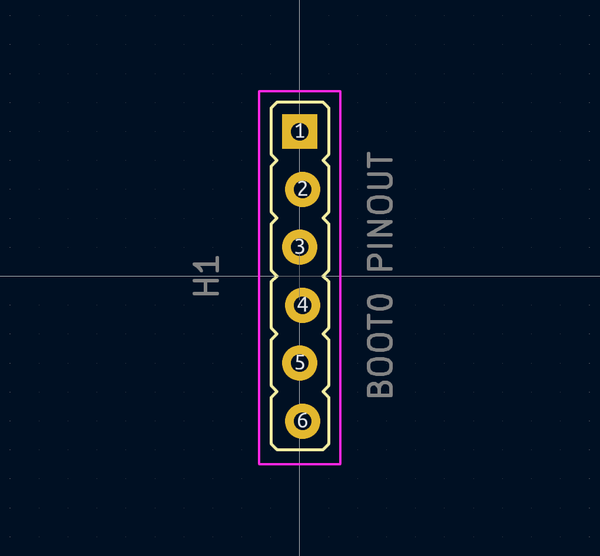
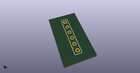
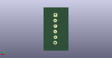
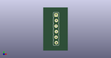

# OOMP Footprint  
## PinHeader_1x6_staggered_P2.54mm_Vertical  by none  
  
oomp key: oomp_acheronproject_acheron_connectors_pinheader_1x6_staggered_p2_54mm_vertical  
  
source repo at: [http://gitlab.com/AcheronProject/acheron_Connectors.pretty/blob/master/tmp/data//oomlout_oomp_footprint_src/XFCN_F1004-H-16-20G-R_P1.0mm_MountingReliefs.kicad_mod](http://gitlab.com/AcheronProject/acheron_Connectors.pretty/blob/master/tmp/data//oomlout_oomp_footprint_src/XFCN_F1004-H-16-20G-R_P1.0mm_MountingReliefs.kicad_mod)  
## Footprint  
  
  
  
  
| name | value | 
| --- | --- | 
| footprint name | PinHeader_1x6_staggered_P2.54mm_Vertical | 
| footprint description | Through hole straight pin header, 1x14, 2.54mm pitch, single row | 
| number of pads | 6 | 
| github path | http://github.com/AcheronProject/acheron_Connectors.pretty/blob/master/tmp/data//oomlout_oomp_footprint_src/PinHeader_1x6_staggered_P2.54mm_Vertical.kicad_mod | 
| oomp key | oomp_acheronproject_acheron_connectors_pinheader_1x6_staggered_p2_54mm_vertical | 
| oomp bot github | https://github.com/oomlout/oomlout_oomp_footprint_bot/tree/main/tmp/data//oomlout_oomp_footprint_src/footprints/acheronproject_acheron_connectors_pinheader_1x6_staggered_p2_54mm_vertical/working | 
## Images  
  
  
  
  
  
  
  
  
