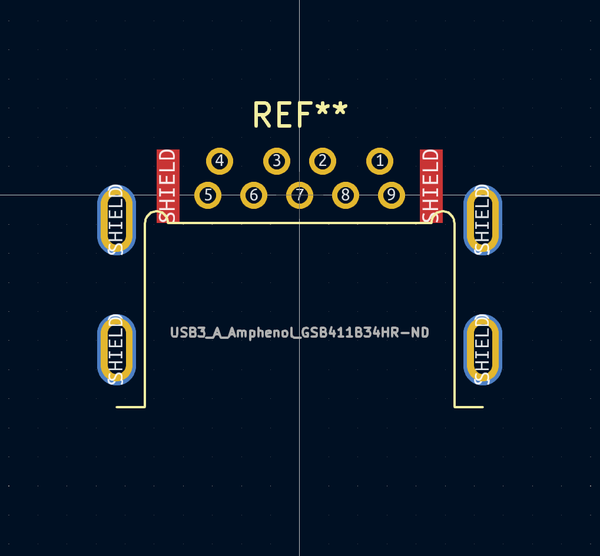

# OOMP Footprint  
## USB3_A_Amphenol_GSB411B34HR  by AcheronProject  
  
oomp key: oomp_acheronproject_acheron_connectors_usb3_a_amphenol_gsb411b34hr  
  
source repo at: [http://github.com/AcheronProject/acheron_Connectors.pretty/blob/master/tmp/data//oomlout_oomp_footprint_src/XFCN_F1004-H-16-20G-R_P1.0mm_MountingReliefs.kicad_mod](http://github.com/AcheronProject/acheron_Connectors.pretty/blob/master/tmp/data//oomlout_oomp_footprint_src/XFCN_F1004-H-16-20G-R_P1.0mm_MountingReliefs.kicad_mod)  
## Footprint  
  
  
  
  
| name | value | 
| --- | --- | 
| footprint name | USB3_A_Amphenol_GSB411B34HR | 
| footprint description | USB 3.0, type A, right angle (http://www.molex.com/pdm_docs/sd/483930003_sd.pdf) | 
| number of pads | 19 | 
| github path | http://github.com/AcheronProject/acheron_Connectors.pretty/blob/master/tmp/data//oomlout_oomp_footprint_src/USB3_A_Amphenol_GSB411B34HR.kicad_mod | 
| oomp key | oomp_acheronproject_acheron_connectors_usb3_a_amphenol_gsb411b34hr | 
| oomp bot github | https://github.com/oomlout/oomlout_oomp_footprint_bot/tree/main/tmp/data//oomlout_oomp_footprint_src/footprints/acheronproject_acheron_connectors_usb3_a_amphenol_gsb411b34hr/working | 
## Images  
  
  
  
  
  
  
  
  
