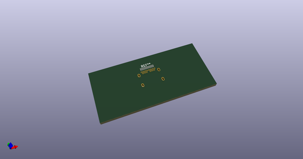

# OOMP Footprint  
## USB_C_Receptacle_Wurth_Elektronik_632723x00011  by none  
  
oomp key: oomp_acheronproject_acheron_connectors_usb_c_receptacle_wurth_elektronik_632723x00011  
  
source repo at: [http://gitlab.com/AcheronProject/acheron_Connectors.pretty/blob/master/tmp/data//oomlout_oomp_footprint_src/XFCN_F1004-H-16-20G-R_P1.0mm_MountingReliefs.kicad_mod](http://gitlab.com/AcheronProject/acheron_Connectors.pretty/blob/master/tmp/data//oomlout_oomp_footprint_src/XFCN_F1004-H-16-20G-R_P1.0mm_MountingReliefs.kicad_mod)  
## Footprint  
  
  
  
  
| name | value | 
| --- | --- | 
| footprint name | USB_C_Receptacle_Wurth_Elektronik_632723x00011 | 
| footprint description | USB TYPE C, RA RCPT PCB, Hybrid, https://www.amphenolcanada.com/StockAvailabilityPrice.aspx?From=&PartNum=12401548E4%7e2A | 
| number of pads | 34 | 
| github path | http://github.com/AcheronProject/acheron_Connectors.pretty/blob/master/tmp/data//oomlout_oomp_footprint_src/USB_C_Receptacle_Wurth_Elektronik_632723x00011.kicad_mod | 
| oomp key | oomp_acheronproject_acheron_connectors_usb_c_receptacle_wurth_elektronik_632723x00011 | 
| oomp bot github | https://github.com/oomlout/oomlout_oomp_footprint_bot/tree/main/tmp/data//oomlout_oomp_footprint_src/footprints/acheronproject_acheron_connectors_usb_c_receptacle_wurth_elektronik_632723x00011/working | 
## Images  
  
  
  
  
  
  
