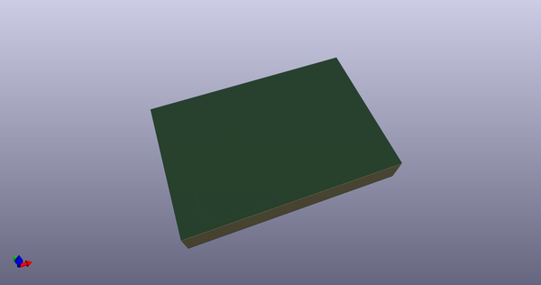
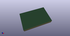

# OOMP Footprint  
## brazilFlag  by none  
  
oomp key: oomp_acheronproject_acheron_graphics_brazil_flag_10x7mm  
  
source repo at: [http://gitlab.com/AcheronProject/acheron_Graphics.pretty/blob/master/tmp/data//oomlout_oomp_footprint_src/Warning_Sign_7.2x6.3mm.kicad_mod](http://gitlab.com/AcheronProject/acheron_Graphics.pretty/blob/master/tmp/data//oomlout_oomp_footprint_src/Warning_Sign_7.2x6.3mm.kicad_mod)  
## Footprint  
  
  
  
  
| name | value | 
| --- | --- | 
| footprint name | brazilFlag | 
| footprint description | None | 
| number of pads | 3 | 
| github path | http://github.com/AcheronProject/acheron_Graphics.pretty/blob/master/tmp/data//oomlout_oomp_footprint_src/Brazil_Flag_10x7mm.kicad_mod | 
| oomp key | oomp_acheronproject_acheron_graphics_brazil_flag_10x7mm | 
| oomp bot github | https://github.com/oomlout/oomlout_oomp_footprint_bot/tree/main/tmp/data//oomlout_oomp_footprint_src/footprints/acheronproject_acheron_graphics_brazil_flag_10x7mm/working | 
## Images  
  
  
  
  
  
  
  
  
