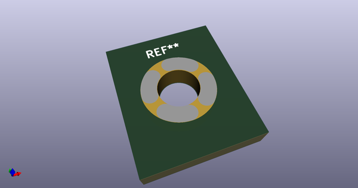
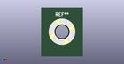

# OOMP Footprint  
## 9774035243R  by AcheronProject  
  
oomp key: oomp_acheronproject_acheron_hardware_9774035243r  
  
source repo at: [http://github.com/AcheronProject/acheron_Hardware.pretty/blob/master/tmp/data/oomlout_oomp_footprint_src/RKJXT1F.kicad_mod](http://github.com/AcheronProject/acheron_Hardware.pretty/blob/master/tmp/data/oomlout_oomp_footprint_src/RKJXT1F.kicad_mod)  
## Footprint  
  
  
  
  
| name | value | 
| --- | --- | 
| footprint name | 9774035243R | 
| footprint description | SMT steel spacer, M2 internal thread | 
| number of pads | 2 | 
| github path | http://github.com/AcheronProject/acheron_Hardware.pretty/blob/master/tmp/data/oomlout_oomp_footprint_src/9774035243R.kicad_mod | 
| oomp key | oomp_acheronproject_acheron_hardware_9774035243r | 
| oomp bot github | https://github.com/oomlout/oomlout_oomp_footprint_bot/tree/main/tmp/data/oomlout_oomp_footprint_src/footprints/acheronproject_acheron_hardware_9774035243r/working | 
## Images  
  
  
  
  
  
  
