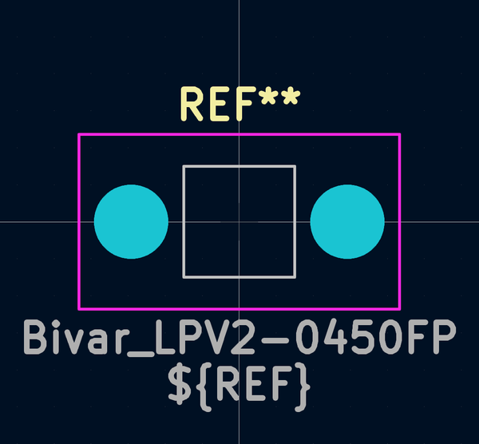
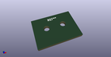

# OOMP Footprint  
## Bivar_LPV2-0450FP  by AcheronProject  
  
oomp key: oomp_acheronproject_acheron_hardware_bivar_lpv2_0450fp  
  
source repo at: [http://github.com/AcheronProject/acheron_Hardware.pretty/blob/master/tmp/data//oomlout_oomp_footprint_src/RKJXT1F.kicad_mod](http://github.com/AcheronProject/acheron_Hardware.pretty/blob/master/tmp/data//oomlout_oomp_footprint_src/RKJXT1F.kicad_mod)  
## Footprint  
  
  
  
  
| name | value | 
| --- | --- | 
| footprint name | Bivar_LPV2-0450FP | 
| footprint description | None | 
| number of pads | 2 | 
| github path | http://github.com/AcheronProject/acheron_Hardware.pretty/blob/master/tmp/data//oomlout_oomp_footprint_src/Bivar_LPV2-0450FP.kicad_mod | 
| oomp key | oomp_acheronproject_acheron_hardware_bivar_lpv2_0450fp | 
| oomp bot github | https://github.com/oomlout/oomlout_oomp_footprint_bot/tree/main/tmp/data//oomlout_oomp_footprint_src/footprints/acheronproject_acheron_hardware_bivar_lpv2_0450fp/working | 
## Images  
  
  
  
  
  
  
