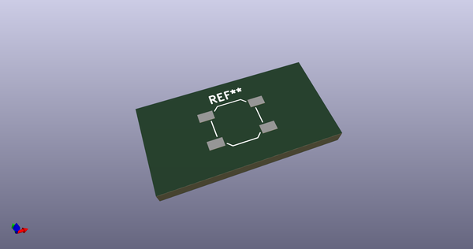
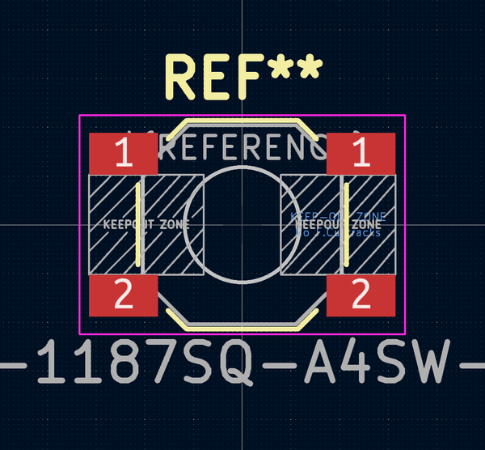
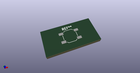
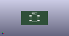

# OOMP Footprint  
## K2-1187SQ-A4SW-06  by AcheronProject  
  
oomp key: oomp_acheronproject_acheron_hardware_k2_1187sq_a4sw_06  
  
source repo at: [http://github.com/AcheronProject/acheron_Hardware.pretty/blob/master/tmp/data//oomlout_oomp_footprint_src/RKJXT1F.kicad_mod](http://github.com/AcheronProject/acheron_Hardware.pretty/blob/master/tmp/data//oomlout_oomp_footprint_src/RKJXT1F.kicad_mod)  
## Footprint  
  
  
  
  
| name | value | 
| --- | --- | 
| footprint name | K2-1187SQ-A4SW-06 | 
| footprint description | ALPS 5.2mm Square Low-profile Type (Surface Mount) SKQG Series, Without stem, http://www.alps.com/prod/info/E/HTML/Tact/SurfaceMount/SKQG/SKQGAEE010.html | 
| number of pads | 4 | 
| github path | http://github.com/AcheronProject/acheron_Hardware.pretty/blob/master/tmp/data//oomlout_oomp_footprint_src/K2-1187SQ-A4SW-06.kicad_mod | 
| oomp key | oomp_acheronproject_acheron_hardware_k2_1187sq_a4sw_06 | 
| oomp bot github | https://github.com/oomlout/oomlout_oomp_footprint_bot/tree/main/tmp/data//oomlout_oomp_footprint_src/footprints/acheronproject_acheron_hardware_k2_1187sq_a4sw_06/working | 
## Images  
  
  
  
  
  
  
  
  
