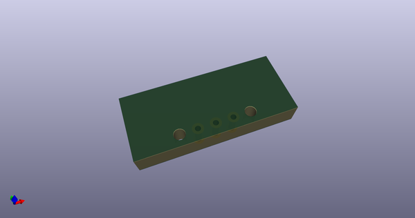
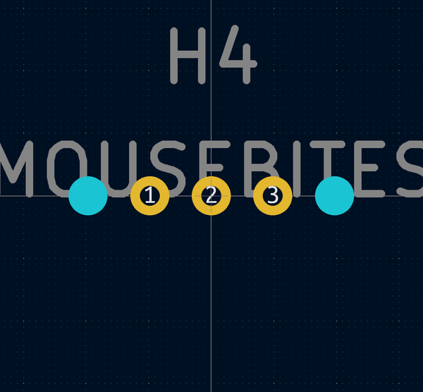
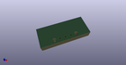
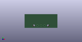

# OOMP Footprint  
## MouseBite_IPC7351_connected  by AcheronProject  
  
oomp key: oomp_acheronproject_acheron_hardware_mousebite_ipc7351_connected  
  
source repo at: [http://github.com/AcheronProject/acheron_Hardware.pretty/blob/master/tmp/data//oomlout_oomp_footprint_src/RKJXT1F.kicad_mod](http://github.com/AcheronProject/acheron_Hardware.pretty/blob/master/tmp/data//oomlout_oomp_footprint_src/RKJXT1F.kicad_mod)  
## Footprint  
  
  
  
  
| name | value | 
| --- | --- | 
| footprint name | MouseBite_IPC7351_connected | 
| footprint description | None | 
| number of pads | 5 | 
| github path | http://github.com/AcheronProject/acheron_Hardware.pretty/blob/master/tmp/data//oomlout_oomp_footprint_src/MouseBite_IPC7351_connected.kicad_mod | 
| oomp key | oomp_acheronproject_acheron_hardware_mousebite_ipc7351_connected | 
| oomp bot github | https://github.com/oomlout/oomlout_oomp_footprint_bot/tree/main/tmp/data//oomlout_oomp_footprint_src/footprints/acheronproject_acheron_hardware_mousebite_ipc7351_connected/working | 
## Images  
  
  
  
  
  
  
  
  
