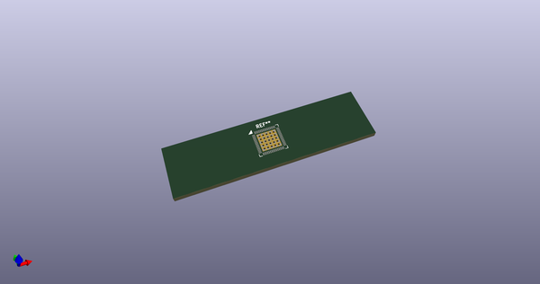
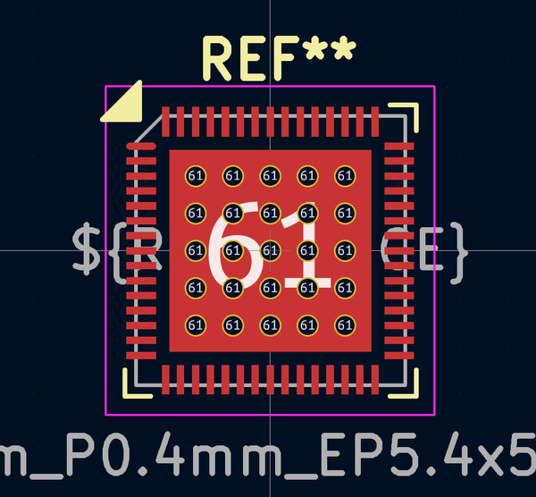
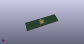

# OOMP Footprint  
## QFN-60-1EP_7x7mm_P0.4mm_EP5.4x5.4mm_ThermalReliefs  by AcheronProject  
  
oomp key: oomp_acheronproject_acheron_hardware_qfn_60_1ep_7x7mm_p0_4mm_ep5_4x5_4mm_thermalreliefs  
  
source repo at: [http://github.com/AcheronProject/acheron_Hardware.pretty/blob/master/tmp/data//oomlout_oomp_footprint_src/RKJXT1F.kicad_mod](http://github.com/AcheronProject/acheron_Hardware.pretty/blob/master/tmp/data//oomlout_oomp_footprint_src/RKJXT1F.kicad_mod)  
## Footprint  
  
  
  
  
| name | value | 
| --- | --- | 
| footprint name | QFN-60-1EP_7x7mm_P0.4mm_EP5.4x5.4mm_ThermalReliefs | 
| footprint description | QFN-60 7x7mm with 0.4mm pitch | 
| number of pads | 112 | 
| github path | http://github.com/AcheronProject/acheron_Hardware.pretty/blob/master/tmp/data//oomlout_oomp_footprint_src/QFN-60-1EP_7x7mm_P0.4mm_EP5.4x5.4mm_ThermalReliefs.kicad_mod | 
| oomp key | oomp_acheronproject_acheron_hardware_qfn_60_1ep_7x7mm_p0_4mm_ep5_4x5_4mm_thermalreliefs | 
| oomp bot github | https://github.com/oomlout/oomlout_oomp_footprint_bot/tree/main/tmp/data//oomlout_oomp_footprint_src/footprints/acheronproject_acheron_hardware_qfn_60_1ep_7x7mm_p0_4mm_ep5_4x5_4mm_thermalreliefs/working | 
## Images  
  
  
  
  
  
  
  
  
