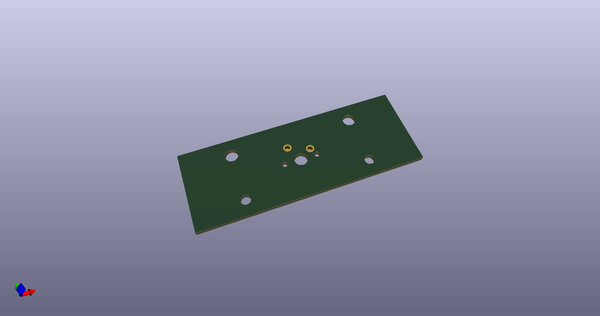
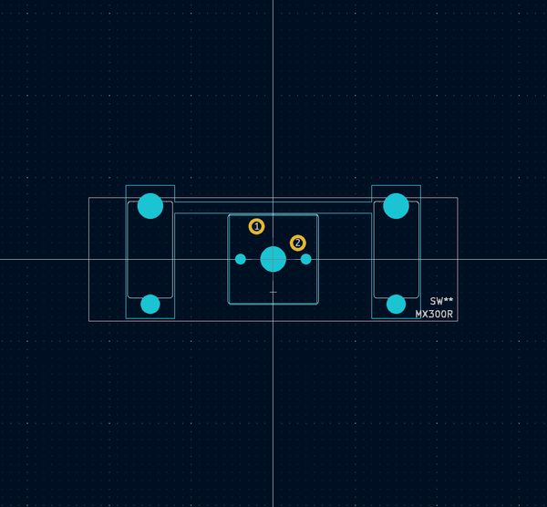
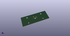
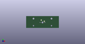

# OOMP Footprint  
## MX300R  by AcheronProject  
  
oomp key: oomp_acheronproject_acheron_mx_mx300r  
  
source repo at: [http://github.com/AcheronProject/acheron_MX.pretty/blob/master/tmp/data/oomlout_oomp_footprint_src/MX_ISOEnter_LED.kicad_mod](http://github.com/AcheronProject/acheron_MX.pretty/blob/master/tmp/data/oomlout_oomp_footprint_src/MX_ISOEnter_LED.kicad_mod)  
## Footprint  
  
  
  
  
| name | value | 
| --- | --- | 
| footprint name | MX300R | 
| footprint description | None | 
| number of pads | 9 | 
| github path | http://github.com/AcheronProject/acheron_MX.pretty/blob/master/tmp/data/oomlout_oomp_footprint_src/MX300R.kicad_mod | 
| oomp key | oomp_acheronproject_acheron_mx_mx300r | 
| oomp bot github | https://github.com/oomlout/oomlout_oomp_footprint_bot/tree/main/tmp/data/oomlout_oomp_footprint_src/footprints/acheronproject_acheron_mx_mx300r/working | 
## Images  
  
  
  
  
  
  
  
  
