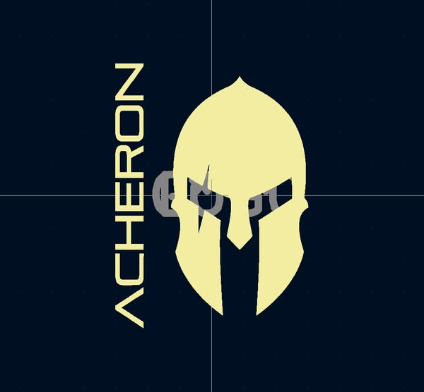
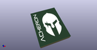

# OOMP Footprint  
## LOGO  by none  
  
oomp key: oomp_acheronproject_acheron_logos_acheronshort_0_3x0_5in  
  
source repo at: [http://gitlab.com/AcheronProject/acheron_Logos.pretty/blob/master/tmp/data//oomlout_oomp_footprint_src/acheronShort_15.2x21mm_Plated.kicad_mod](http://gitlab.com/AcheronProject/acheron_Logos.pretty/blob/master/tmp/data//oomlout_oomp_footprint_src/acheronShort_15.2x21mm_Plated.kicad_mod)  
## Footprint  
  
  
  
  
| name | value | 
| --- | --- | 
| footprint name | LOGO | 
| footprint description | None | 
| number of pads | 0 | 
| github path | http://github.com/AcheronProject/acheron_Logos.pretty/blob/master/tmp/data//oomlout_oomp_footprint_src/acheronShort_0.3x0.5in.kicad_mod | 
| oomp key | oomp_acheronproject_acheron_logos_acheronshort_0_3x0_5in | 
| oomp bot github | https://github.com/oomlout/oomlout_oomp_footprint_bot/tree/main/tmp/data//oomlout_oomp_footprint_src/footprints/acheronproject_acheron_logos_acheronshort_0_3x0_5in/working | 
## Images  
  
  
  
  
  
  
  
  
