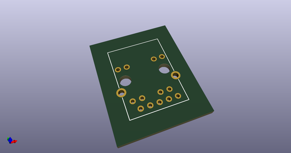
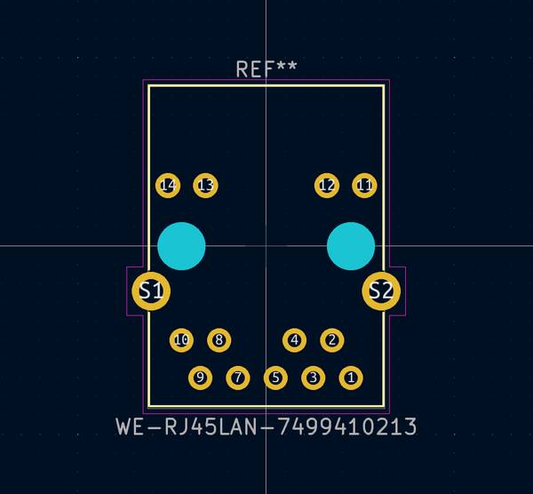
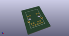
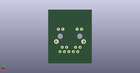
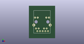

# OOMP Footprint  
## WE-RJ45LAN-7499410213  by none  
  
oomp key: oomp_adamgreig_agg_we_rj45lan_7499410213  
  
source repo at: [http://gitlab.com/adamgreig/agg-kicad/blob/master/tmp/data//oomlout_oomp_footprint_src/agg.pretty/unchecked.pretty/XTAL50x32.kicad_mod](http://gitlab.com/adamgreig/agg-kicad/blob/master/tmp/data//oomlout_oomp_footprint_src/agg.pretty/unchecked.pretty/XTAL50x32.kicad_mod)  
## Footprint  
  
  
  
  
| name | value | 
| --- | --- | 
| footprint name | WE-RJ45LAN-7499410213 | 
| footprint description | 10/100Base-TX RJ45 ethernet magnetic transformer connector horizontal https://katalog.we-online.de/pbs/datasheet/7499010121A.pdf | 
| number of pads | 17 | 
| github path | http://github.com/adamgreig/agg-kicad/blob/master/tmp/data//oomlout_oomp_footprint_src/agg.pretty/WE-RJ45LAN-7499410213.kicad_mod | 
| oomp key | oomp_adamgreig_agg_we_rj45lan_7499410213 | 
| oomp bot github | https://github.com/oomlout/oomlout_oomp_footprint_bot/tree/main/tmp/data//oomlout_oomp_footprint_src/footprints/adamgreig_agg_we_rj45lan_7499410213/working | 
## Images  
  
  
  
  
  
  
