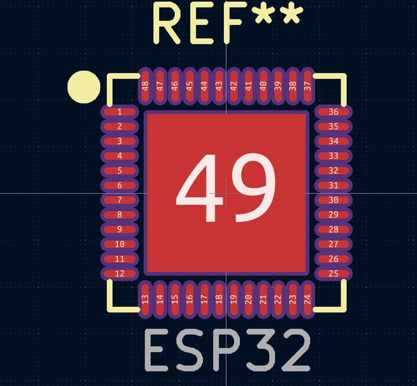
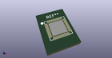
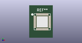

# OOMP Footprint  
## ESP32  by adamjvr  
  
oomp key: oomp_adamjvr_esp32_footprints_lib_esp32  
  
source repo at: [http://github.com/adamjvr/ESP32-kiCAD-Footprints/blob/master/tmp/data/oomlout_oomp_footprint_src/ESP32-Footprints/ESP32-footprints-Lib.pretty/ESP3212.kicad_mod](http://github.com/adamjvr/ESP32-kiCAD-Footprints/blob/master/tmp/data/oomlout_oomp_footprint_src/ESP32-Footprints/ESP32-footprints-Lib.pretty/ESP3212.kicad_mod)  
## Footprint  
  
  
  
  
| name | value | 
| --- | --- | 
| footprint name | ESP32 | 
| footprint description | None | 
| number of pads | 49 | 
| github path | http://github.com/adamjvr/ESP32-kiCAD-Footprints/blob/master/tmp/data/oomlout_oomp_footprint_src/ESP32-Footprints/ESP32-footprints-Lib.pretty/ESP32.kicad_mod | 
| oomp key | oomp_adamjvr_esp32_footprints_lib_esp32 | 
| oomp bot github | https://github.com/oomlout/oomlout_oomp_footprint_bot/tree/main/tmp/data/oomlout_oomp_footprint_src/footprints/adamjvr_esp32_footprints_lib_esp32/working | 
## Images  
  
  
  
  
  
  
  
  
