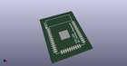

# OOMP Footprint  
## ESP-32S  by adamjvr  
  
oomp key: oomp_adamjvr_esp32_footprints_lib_esp_32s  
  
source repo at: [http://github.com/adamjvr/ESP32-kiCAD-Footprints/blob/master/tmp/data//oomlout_oomp_footprint_src/ESP32-Footprints/ESP32-footprints-Lib.pretty/ESP3212.kicad_mod](http://github.com/adamjvr/ESP32-kiCAD-Footprints/blob/master/tmp/data//oomlout_oomp_footprint_src/ESP32-Footprints/ESP32-footprints-Lib.pretty/ESP3212.kicad_mod)  
## Footprint  
  
  
  
  
| name | value | 
| --- | --- | 
| footprint name | ESP-32S | 
| footprint description | None | 
| number of pads | 39 | 
| github path | http://github.com/adamjvr/ESP32-kiCAD-Footprints/blob/master/tmp/data//oomlout_oomp_footprint_src/ESP32-Footprints/ESP32-footprints-Lib.pretty/ESP-32S.kicad_mod | 
| oomp key | oomp_adamjvr_esp32_footprints_lib_esp_32s | 
| oomp bot github | https://github.com/oomlout/oomlout_oomp_footprint_bot/tree/main/tmp/data//oomlout_oomp_footprint_src/footprints/adamjvr_esp32_footprints_lib_esp_32s/working | 
## Images  
  
  
  
  
  
  
  
  
