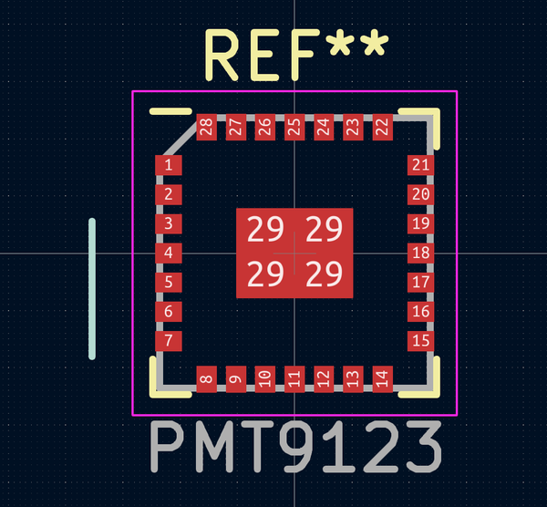
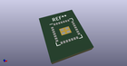
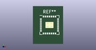

# OOMP Footprint  
## aesora:PMT9123  by m-byte  
  
oomp key: oomp_aesora_aesora_pmt9123  
  
source repo at: [http://github.com/aesora/aesora.pretty/blob/master/tmp/data/oomlout_oomp_footprint_src/PMT9123.kicad_mod](http://github.com/aesora/aesora.pretty/blob/master/tmp/data/oomlout_oomp_footprint_src/PMT9123.kicad_mod)  
## Footprint  
  
  
  
  
| name | value | 
| --- | --- | 
| footprint name | aesora:PMT9123 | 
| footprint description | PMT9123; 28-Lead Plastic Quad Flat, No Lead Package (ML) - 6x6 mm Body [QFN]; (see Pixart PMT9123QS-TVIT-NNDS-v1.02-120716_20160906201433.pdf) | 
| number of pads | 32 | 
| github path | http://github.com/aesora/aesora.pretty/blob/master/tmp/data/oomlout_oomp_footprint_src/PMT9123.kicad_mod | 
| oomp key | oomp_aesora_aesora_pmt9123 | 
| oomp bot github | https://github.com/oomlout/oomlout_oomp_footprint_bot/tree/main/tmp/data/oomlout_oomp_footprint_src/footprints/aesora_aesora_pmt9123/working | 
## Images  
  
  
  
  
  
  
  
  
