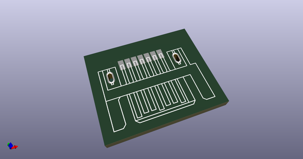
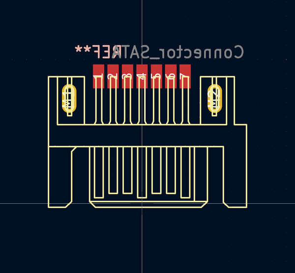
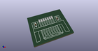
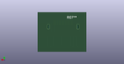
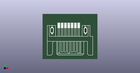

# OOMP Footprint  
## Connector_SATA-7_SMD_mod  by aewallin  
  
oomp key: oomp_aewallin_awallinkicadfootprints_connector_sata_7_smd_mod  
  
source repo at: [http://github.com/aewallin/awallinKiCadFootprints.pretty/blob/master/tmp/data/oomlout_oomp_footprint_src/Y3split_0.350mm.kicad_mod](http://github.com/aewallin/awallinKiCadFootprints.pretty/blob/master/tmp/data/oomlout_oomp_footprint_src/Y3split_0.350mm.kicad_mod)  
## Footprint  
  
  
  
  
| name | value | 
| --- | --- | 
| footprint name | Connector_SATA-7_SMD_mod | 
| footprint description | SERIAL ATA 7P R/A SMT | 
| number of pads | 9 | 
| github path | http://github.com/aewallin/awallinKiCadFootprints.pretty/blob/master/tmp/data/oomlout_oomp_footprint_src/Connector_SATA-7_SMD_mod.kicad_mod | 
| oomp key | oomp_aewallin_awallinkicadfootprints_connector_sata_7_smd_mod | 
| oomp bot github | https://github.com/oomlout/oomlout_oomp_footprint_bot/tree/main/tmp/data/oomlout_oomp_footprint_src/footprints/aewallin_awallinkicadfootprints_connector_sata_7_smd_mod/working | 
## Images  
  
  
  
  
  
  
  
  
