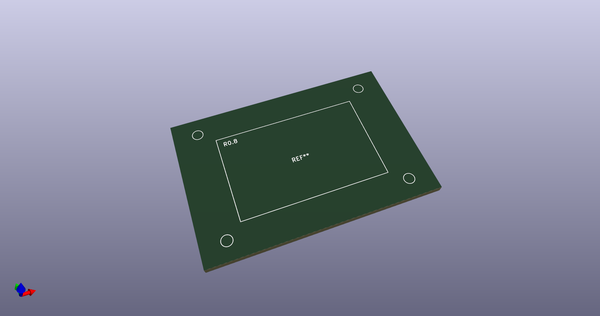
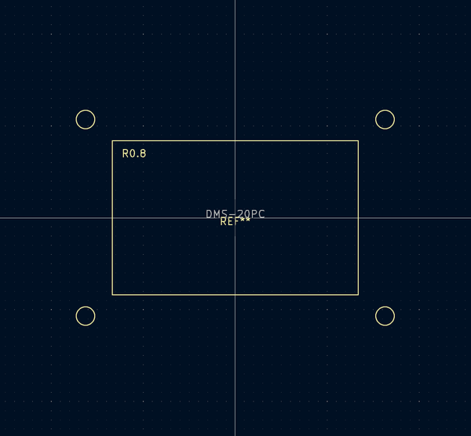
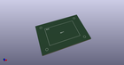
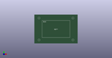

# OOMP Footprint  
## DMS-20PC  by none  
  
oomp key: oomp_aewallin_awallinkicadfootprints_dms_20pc  
  
source repo at: [http://gitlab.com/aewallin/awallinKiCadFootprints.pretty/blob/master/tmp/data//oomlout_oomp_footprint_src/Y3split_0.350mm.kicad_mod](http://gitlab.com/aewallin/awallinKiCadFootprints.pretty/blob/master/tmp/data//oomlout_oomp_footprint_src/Y3split_0.350mm.kicad_mod)  
## Footprint  
  
  
  
  
| name | value | 
| --- | --- | 
| footprint name | DMS-20PC | 
| footprint description | panel cutout for 3.5 digit DMS-20PC display | 
| number of pads | 0 | 
| github path | http://github.com/aewallin/awallinKiCadFootprints.pretty/blob/master/tmp/data//oomlout_oomp_footprint_src/DMS-20PC.kicad_mod | 
| oomp key | oomp_aewallin_awallinkicadfootprints_dms_20pc | 
| oomp bot github | https://github.com/oomlout/oomlout_oomp_footprint_bot/tree/main/tmp/data//oomlout_oomp_footprint_src/footprints/aewallin_awallinkicadfootprints_dms_20pc/working | 
## Images  
  
  
  
  
  
  
  
  
