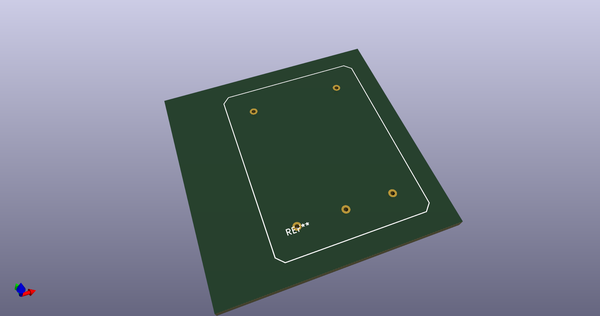
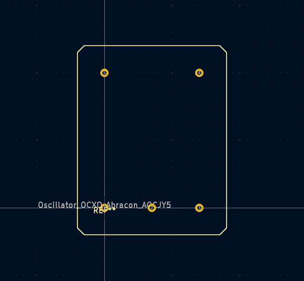
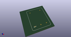
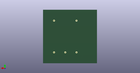
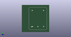

# OOMP Footprint  
## Oscillator_OCXO_Abracon_AOCJY5  by none  
  
oomp key: oomp_aewallin_awallinkicadfootprints_oscillator_ocxo_abracon_aocjy5  
  
source repo at: [http://gitlab.com/aewallin/awallinKiCadFootprints.pretty/blob/master/tmp/data//oomlout_oomp_footprint_src/Y3split_0.350mm.kicad_mod](http://gitlab.com/aewallin/awallinKiCadFootprints.pretty/blob/master/tmp/data//oomlout_oomp_footprint_src/Y3split_0.350mm.kicad_mod)  
## Footprint  
  
  
  
  
| name | value | 
| --- | --- | 
| footprint name | Oscillator_OCXO_Abracon_AOCJY5 | 
| footprint description | None | 
| number of pads | 5 | 
| github path | http://github.com/aewallin/awallinKiCadFootprints.pretty/blob/master/tmp/data//oomlout_oomp_footprint_src/Oscillator_OCXO_Abracon_AOCJY5.kicad_mod | 
| oomp key | oomp_aewallin_awallinkicadfootprints_oscillator_ocxo_abracon_aocjy5 | 
| oomp bot github | https://github.com/oomlout/oomlout_oomp_footprint_bot/tree/main/tmp/data//oomlout_oomp_footprint_src/footprints/aewallin_awallinkicadfootprints_oscillator_ocxo_abracon_aocjy5/working | 
## Images  
  
  
  
  
  
  
  
  
