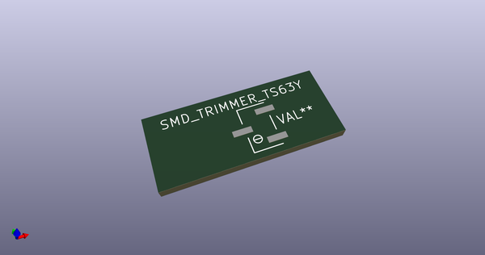
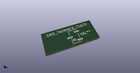
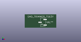

# OOMP Footprint  
## SMD_TRIMMER_TS63Y  by none  
  
oomp key: oomp_aewallin_awallinkicadfootprints_smd_trimmer_ts63y  
  
source repo at: [http://gitlab.com/aewallin/awallinKiCadFootprints.pretty/blob/master/tmp/data//oomlout_oomp_footprint_src/Y3split_0.350mm.kicad_mod](http://gitlab.com/aewallin/awallinKiCadFootprints.pretty/blob/master/tmp/data//oomlout_oomp_footprint_src/Y3split_0.350mm.kicad_mod)  
## Footprint  
  
  
  
  
| name | value | 
| --- | --- | 
| footprint name | SMD_TRIMMER_TS63Y | 
| footprint description | None | 
| number of pads | 3 | 
| github path | http://github.com/aewallin/awallinKiCadFootprints.pretty/blob/master/tmp/data//oomlout_oomp_footprint_src/SMD_TRIMMER_TS63Y.kicad_mod | 
| oomp key | oomp_aewallin_awallinkicadfootprints_smd_trimmer_ts63y | 
| oomp bot github | https://github.com/oomlout/oomlout_oomp_footprint_bot/tree/main/tmp/data//oomlout_oomp_footprint_src/footprints/aewallin_awallinkicadfootprints_smd_trimmer_ts63y/working | 
## Images  
  
  
  
  
  
  
  
  
