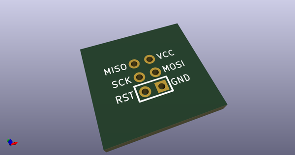
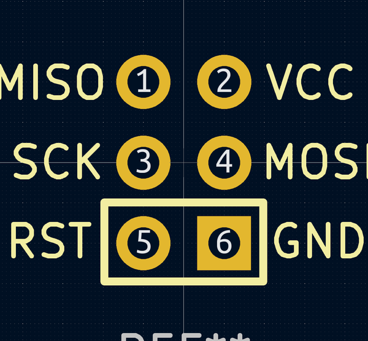
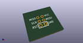
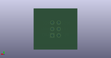
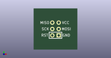

# OOMP Footprint  
## Reset_Pretty-Mask  by none  
  
oomp key: oomp_ai03_2725_molex_0548190589_reset_pretty_mask  
  
source repo at: [http://gitlab.com/ai03-2725/Molex-0548190589.pretty/blob/master/tmp/data//oomlout_oomp_footprint_src/USON-TPDxE05U06.kicad_mod](http://gitlab.com/ai03-2725/Molex-0548190589.pretty/blob/master/tmp/data//oomlout_oomp_footprint_src/USON-TPDxE05U06.kicad_mod)  
## Footprint  
  
  
  
  
| name | value | 
| --- | --- | 
| footprint name | Reset_Pretty-Mask | 
| footprint description | None | 
| number of pads | 6 | 
| github path | http://github.com/ai03-2725/Molex-0548190589.pretty/blob/master/tmp/data//oomlout_oomp_footprint_src/Reset_Pretty-Mask.kicad_mod | 
| oomp key | oomp_ai03_2725_molex_0548190589_reset_pretty_mask | 
| oomp bot github | https://github.com/oomlout/oomlout_oomp_footprint_bot/tree/main/tmp/data//oomlout_oomp_footprint_src/footprints/ai03_2725_molex_0548190589_reset_pretty_mask/working | 
## Images  
  
  
  
  
  
  
  
  
