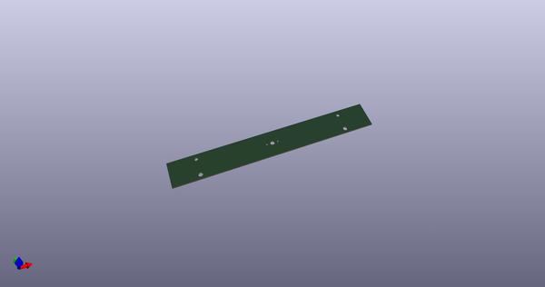
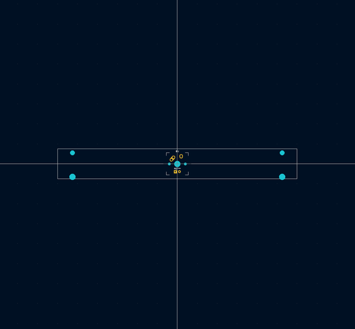
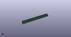
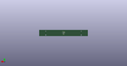
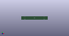

# OOMP Footprint  
## MX-8U-FLIPPED-Pretty  by ai03-2725  
  
oomp key: oomp_ai03_2725_mx_alps_hybrid_mx_8u_flipped  
  
source repo at: [http://github.com/ai03-2725/MX_Alps_Hybrid.pretty/blob/master/tmp/data/oomlout_oomp_footprint_src/MX_Only.pretty/MXOnly-LEDONLY.kicad_mod](http://github.com/ai03-2725/MX_Alps_Hybrid.pretty/blob/master/tmp/data/oomlout_oomp_footprint_src/MX_Only.pretty/MXOnly-LEDONLY.kicad_mod)  
## Footprint  
  
  
  
  
| name | value | 
| --- | --- | 
| footprint name | MX-8U-FLIPPED-Pretty | 
| footprint description | None | 
| number of pads | 13 | 
| github path | http://github.com/ai03-2725/MX_Alps_Hybrid.pretty/blob/master/tmp/data/oomlout_oomp_footprint_src/MX_Alps_Hybrid.pretty/MX-8U-FLIPPED.kicad_mod | 
| oomp key | oomp_ai03_2725_mx_alps_hybrid_mx_8u_flipped | 
| oomp bot github | https://github.com/oomlout/oomlout_oomp_footprint_bot/tree/main/tmp/data/oomlout_oomp_footprint_src/footprints/ai03_2725_mx_alps_hybrid_mx_8u_flipped/working | 
## Images  
  
  
  
  
  
  
  
  
