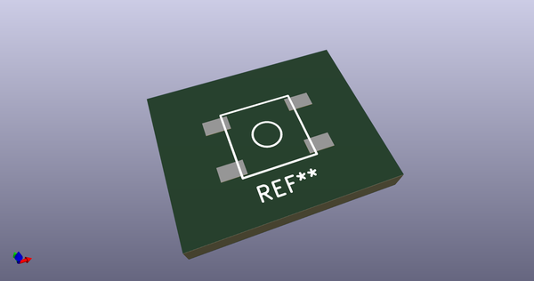
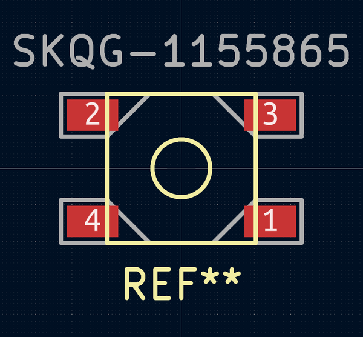
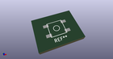
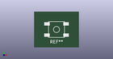

# OOMP Footprint  
## SKQG-1155865  by ai03-2725  
  
oomp key: oomp_ai03_2725_random_keyboard_parts_skqg_1155865  
  
source repo at: [http://github.com/ai03-2725/random-keyboard-parts.pretty/blob/master/tmp/data//oomlout_oomp_footprint_src/USON-TPDxE05U06.kicad_mod](http://github.com/ai03-2725/random-keyboard-parts.pretty/blob/master/tmp/data//oomlout_oomp_footprint_src/USON-TPDxE05U06.kicad_mod)  
## Footprint  
  
  
  
  
| name | value | 
| --- | --- | 
| footprint name | SKQG-1155865 | 
| footprint description | None | 
| number of pads | 4 | 
| github path | http://github.com/ai03-2725/random-keyboard-parts.pretty/blob/master/tmp/data//oomlout_oomp_footprint_src/SKQG-1155865.kicad_mod | 
| oomp key | oomp_ai03_2725_random_keyboard_parts_skqg_1155865 | 
| oomp bot github | https://github.com/oomlout/oomlout_oomp_footprint_bot/tree/main/tmp/data//oomlout_oomp_footprint_src/footprints/ai03_2725_random_keyboard_parts_skqg_1155865/working | 
## Images  
  
  
  
  
  
  
