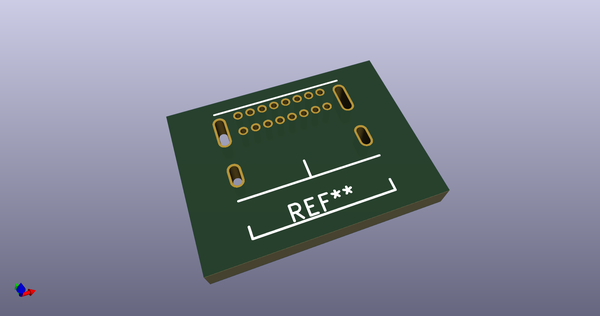
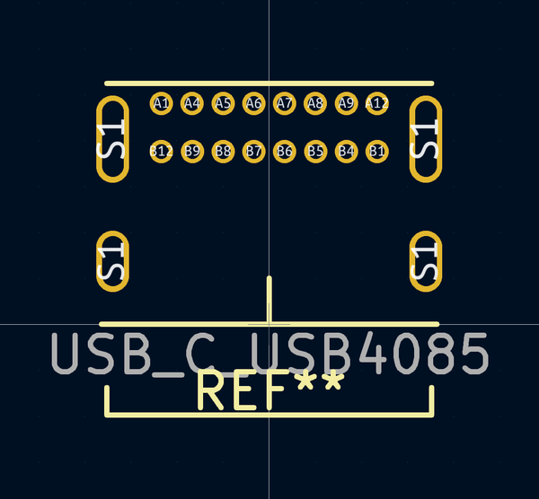
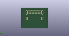
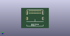

# OOMP Footprint  
## Connector_USB:USB_C_USB4085  by ai03-2725  
  
oomp key: oomp_ai03_2725_type_c_usb_c_gct_usb4085  
  
source repo at: [http://github.com/ai03-2725/Type-C.pretty/blob/master/tmp/data/oomlout_oomp_footprint_src/Wurth-632723300011.kicad_mod](http://github.com/ai03-2725/Type-C.pretty/blob/master/tmp/data/oomlout_oomp_footprint_src/Wurth-632723300011.kicad_mod)  
## Footprint  
  
  
  
  
| name | value | 
| --- | --- | 
| footprint name | Connector_USB:USB_C_USB4085 | 
| footprint description | None | 
| number of pads | 20 | 
| github path | http://github.com/ai03-2725/Type-C.pretty/blob/master/tmp/data/oomlout_oomp_footprint_src/USB_C_GCT_USB4085.kicad_mod | 
| oomp key | oomp_ai03_2725_type_c_usb_c_gct_usb4085 | 
| oomp bot github | https://github.com/oomlout/oomlout_oomp_footprint_bot/tree/main/tmp/data/oomlout_oomp_footprint_src/footprints/ai03_2725_type_c_usb_c_gct_usb4085/working | 
## Images  
  
  
  
  
  
  
  
  
