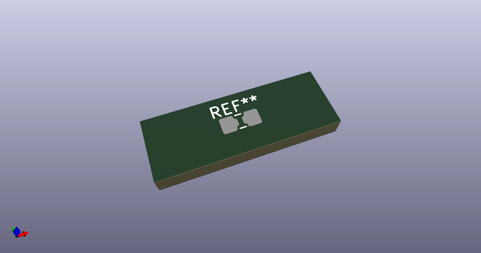
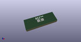

# OOMP Footprint  
## 0402to0805_metric1005to2012_HandSolder  by none  
  
oomp key: oomp_akiyukiokayasu_kicad_akiyuki_footprint_0402to0805_metric1005to2012_handsolder  
  
source repo at: [http://gitlab.com/AkiyukiOkayasu/Kicad_Akiyuki_Footprint.pretty/blob/master/tmp/data//oomlout_oomp_footprint_src/USB_MicroB_PowerOnly.kicad_mod](http://gitlab.com/AkiyukiOkayasu/Kicad_Akiyuki_Footprint.pretty/blob/master/tmp/data//oomlout_oomp_footprint_src/USB_MicroB_PowerOnly.kicad_mod)  
## Footprint  
  
  
  
  
| name | value | 
| --- | --- | 
| footprint name | 0402to0805_metric1005to2012_HandSolder | 
| footprint description | SMD Handsolder | 
| number of pads | 6 | 
| github path | http://github.com/AkiyukiOkayasu/Kicad_Akiyuki_Footprint.pretty/blob/master/tmp/data//oomlout_oomp_footprint_src/0402to0805_metric1005to2012_HandSolder.kicad_mod | 
| oomp key | oomp_akiyukiokayasu_kicad_akiyuki_footprint_0402to0805_metric1005to2012_handsolder | 
| oomp bot github | https://github.com/oomlout/oomlout_oomp_footprint_bot/tree/main/tmp/data//oomlout_oomp_footprint_src/footprints/akiyukiokayasu_kicad_akiyuki_footprint_0402to0805_metric1005to2012_handsolder/working | 
## Images  
  
  
  
  
  
  
  
  
