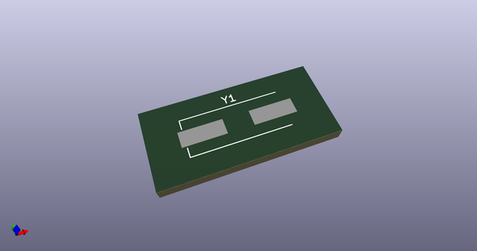
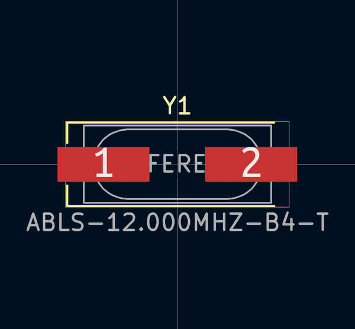
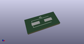
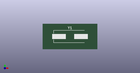

# OOMP Footprint  
## Crystal_SMD_HC49-US  by none  
  
oomp key: oomp_akiyukiokayasu_kicad_akiyuki_footprint_crystal_smd_hc49_us  
  
source repo at: [http://gitlab.com/AkiyukiOkayasu/Kicad_Akiyuki_Footprint.pretty/blob/master/tmp/data//oomlout_oomp_footprint_src/USB_MicroB_PowerOnly.kicad_mod](http://gitlab.com/AkiyukiOkayasu/Kicad_Akiyuki_Footprint.pretty/blob/master/tmp/data//oomlout_oomp_footprint_src/USB_MicroB_PowerOnly.kicad_mod)  
## Footprint  
  
  
  
  
| name | value | 
| --- | --- | 
| footprint name | Crystal_SMD_HC49-US | 
| footprint description | SMD Crystal HC-49-SD http://cdn-reichelt.de/documents/datenblatt/B400/xxx-HC49-SMD.pdf, 11.4x4.7mm^2 package | 
| number of pads | 2 | 
| github path | http://github.com/AkiyukiOkayasu/Kicad_Akiyuki_Footprint.pretty/blob/master/tmp/data//oomlout_oomp_footprint_src/Crystal_SMD_HC49-US.kicad_mod | 
| oomp key | oomp_akiyukiokayasu_kicad_akiyuki_footprint_crystal_smd_hc49_us | 
| oomp bot github | https://github.com/oomlout/oomlout_oomp_footprint_bot/tree/main/tmp/data//oomlout_oomp_footprint_src/footprints/akiyukiokayasu_kicad_akiyuki_footprint_crystal_smd_hc49_us/working | 
## Images  
  
  
  
  
  
  
  
  
