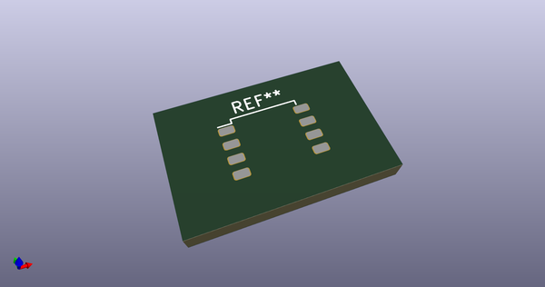
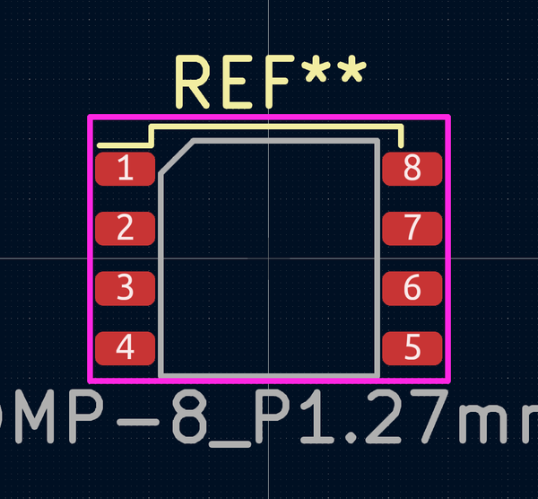
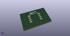
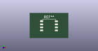

# OOMP Footprint  
## DMP-8_P1.27mm  by AkiyukiOkayasu  
  
oomp key: oomp_akiyukiokayasu_kicad_akiyuki_footprint_dmp_8_p1_27mm  
  
source repo at: [http://github.com/AkiyukiOkayasu/Kicad_Akiyuki_Footprint.pretty/blob/master/tmp/data/oomlout_oomp_footprint_src/USB_MicroB_PowerOnly.kicad_mod](http://github.com/AkiyukiOkayasu/Kicad_Akiyuki_Footprint.pretty/blob/master/tmp/data/oomlout_oomp_footprint_src/USB_MicroB_PowerOnly.kicad_mod)  
## Footprint  
  
  
  
  
| name | value | 
| --- | --- | 
| footprint name | DMP-8_P1.27mm | 
| footprint description | NJM_DMP-8 | 
| number of pads | 8 | 
| github path | http://github.com/AkiyukiOkayasu/Kicad_Akiyuki_Footprint.pretty/blob/master/tmp/data/oomlout_oomp_footprint_src/DMP-8_P1.27mm.kicad_mod | 
| oomp key | oomp_akiyukiokayasu_kicad_akiyuki_footprint_dmp_8_p1_27mm | 
| oomp bot github | https://github.com/oomlout/oomlout_oomp_footprint_bot/tree/main/tmp/data/oomlout_oomp_footprint_src/footprints/akiyukiokayasu_kicad_akiyuki_footprint_dmp_8_p1_27mm/working | 
## Images  
  
  
  
  
  
  
  
  
