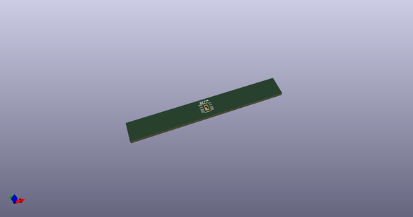
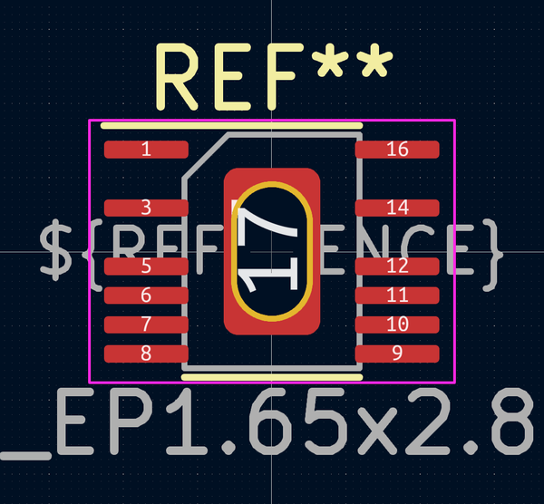
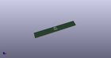

# OOMP Footprint  
## MSOP-16-1EP_3x4mm_P0.5mm_EP1.65x2.85mm_4pinsRemoved_HandSolder  by AkiyukiOkayasu  
  
oomp key: oomp_akiyukiokayasu_kicad_akiyuki_footprint_msop_16_1ep_3x4mm_p0_5mm_ep1_65x2_85mm_4pinsremoved_handsolder  
  
source repo at: [http://github.com/AkiyukiOkayasu/Kicad_Akiyuki_Footprint.pretty/blob/master/tmp/data/oomlout_oomp_footprint_src/USB_MicroB_PowerOnly.kicad_mod](http://github.com/AkiyukiOkayasu/Kicad_Akiyuki_Footprint.pretty/blob/master/tmp/data/oomlout_oomp_footprint_src/USB_MicroB_PowerOnly.kicad_mod)  
## Footprint  
  
  
  
  
| name | value | 
| --- | --- | 
| footprint name | MSOP-16-1EP_3x4mm_P0.5mm_EP1.65x2.85mm_4pinsRemoved_HandSolder | 
| footprint description | MSOP, 16 Pin (http://cds.linear.com/docs/en/datasheet/37551fd.pdf#page=23), generated with kicad-footprint-generator ipc_gullwing_generator.py | 
| number of pads | 14 | 
| github path | http://github.com/AkiyukiOkayasu/Kicad_Akiyuki_Footprint.pretty/blob/master/tmp/data/oomlout_oomp_footprint_src/MSOP-16-1EP_3x4mm_P0.5mm_EP1.65x2.85mm_4pinsRemoved_HandSolder.kicad_mod | 
| oomp key | oomp_akiyukiokayasu_kicad_akiyuki_footprint_msop_16_1ep_3x4mm_p0_5mm_ep1_65x2_85mm_4pinsremoved_handsolder | 
| oomp bot github | https://github.com/oomlout/oomlout_oomp_footprint_bot/tree/main/tmp/data/oomlout_oomp_footprint_src/footprints/akiyukiokayasu_kicad_akiyuki_footprint_msop_16_1ep_3x4mm_p0_5mm_ep1_65x2_85mm_4pinsremoved_handsolder/working | 
## Images  
  
  
  
  
  
  
  
  
