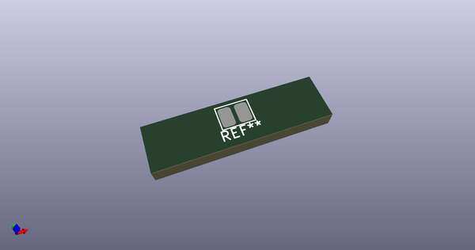
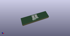

# OOMP Footprint  
## Murata_XRCHA-F-A  by AkiyukiOkayasu  
  
oomp key: oomp_akiyukiokayasu_kicad_akiyuki_footprint_murata_xrcha_f_a  
  
source repo at: [http://github.com/AkiyukiOkayasu/Kicad_Akiyuki_Footprint.pretty/blob/master/tmp/data/oomlout_oomp_footprint_src/USB_MicroB_PowerOnly.kicad_mod](http://github.com/AkiyukiOkayasu/Kicad_Akiyuki_Footprint.pretty/blob/master/tmp/data/oomlout_oomp_footprint_src/USB_MicroB_PowerOnly.kicad_mod)  
## Footprint  
  
  
  
  
| name | value | 
| --- | --- | 
| footprint name | Murata_XRCHA-F-A | 
| footprint description | None | 
| number of pads | 2 | 
| github path | http://github.com/AkiyukiOkayasu/Kicad_Akiyuki_Footprint.pretty/blob/master/tmp/data/oomlout_oomp_footprint_src/Murata_XRCHA-F-A.kicad_mod | 
| oomp key | oomp_akiyukiokayasu_kicad_akiyuki_footprint_murata_xrcha_f_a | 
| oomp bot github | https://github.com/oomlout/oomlout_oomp_footprint_bot/tree/main/tmp/data/oomlout_oomp_footprint_src/footprints/akiyukiokayasu_kicad_akiyuki_footprint_murata_xrcha_f_a/working | 
## Images  
  
  
  
  
  
  
  
  
