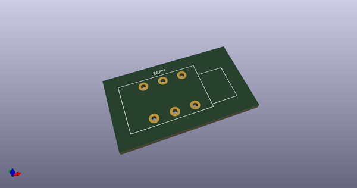
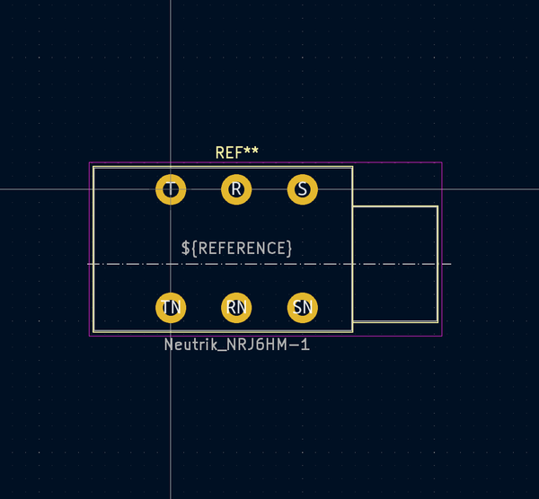
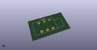
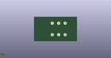
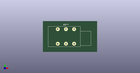

# OOMP Footprint  
## Neutrik_NRJ6HM-1  by AkiyukiOkayasu  
  
oomp key: oomp_akiyukiokayasu_kicad_akiyuki_footprint_neutrik_nrj6hm_1  
  
source repo at: [http://github.com/AkiyukiOkayasu/Kicad_Akiyuki_Footprint.pretty/blob/master/tmp/data/oomlout_oomp_footprint_src/USB_MicroB_PowerOnly.kicad_mod](http://github.com/AkiyukiOkayasu/Kicad_Akiyuki_Footprint.pretty/blob/master/tmp/data/oomlout_oomp_footprint_src/USB_MicroB_PowerOnly.kicad_mod)  
## Footprint  
  
  
  
  
| name | value | 
| --- | --- | 
| footprint name | Neutrik_NRJ6HM-1 | 
| footprint description | Slim Jacks, 6.35mm (1/4in) stereo jack, metal nose with efficient chassis ground connection, T+R+S normalling contact, https://www.neutrik.com/en/product/nrj6hm-1 | 
| number of pads | 6 | 
| github path | http://github.com/AkiyukiOkayasu/Kicad_Akiyuki_Footprint.pretty/blob/master/tmp/data/oomlout_oomp_footprint_src/Neutrik_NRJ6HM-1.kicad_mod | 
| oomp key | oomp_akiyukiokayasu_kicad_akiyuki_footprint_neutrik_nrj6hm_1 | 
| oomp bot github | https://github.com/oomlout/oomlout_oomp_footprint_bot/tree/main/tmp/data/oomlout_oomp_footprint_src/footprints/akiyukiokayasu_kicad_akiyuki_footprint_neutrik_nrj6hm_1/working | 
## Images  
  
  
  
  
  
  
  
  
