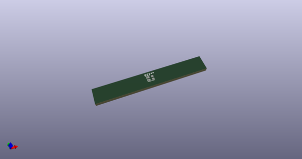
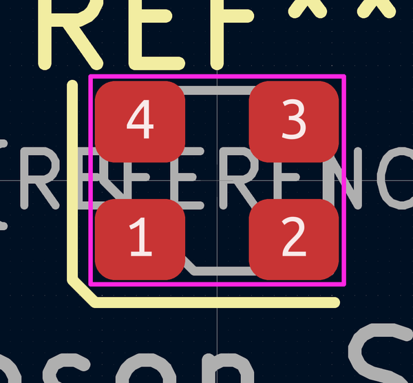
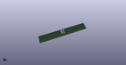

# OOMP Footprint  
## Oscillator_SMD_SeikoEpson_SG210-4Pin_2.5x2.0mm  by AkiyukiOkayasu  
  
oomp key: oomp_akiyukiokayasu_kicad_akiyuki_footprint_oscillator_smd_seikoepson_sg210_4pin_2_5x2_0mm  
  
source repo at: [http://github.com/AkiyukiOkayasu/Kicad_Akiyuki_Footprint.pretty/blob/master/tmp/data//oomlout_oomp_footprint_src/USB_MicroB_PowerOnly.kicad_mod](http://github.com/AkiyukiOkayasu/Kicad_Akiyuki_Footprint.pretty/blob/master/tmp/data//oomlout_oomp_footprint_src/USB_MicroB_PowerOnly.kicad_mod)  
## Footprint  
  
  
  
  
| name | value | 
| --- | --- | 
| footprint name | Oscillator_SMD_SeikoEpson_SG210-4Pin_2.5x2.0mm | 
| footprint description | SMD Crystal Oscillator Seiko Epson SG-210 https://support.epson.biz/td/api/doc_check.php?mode=dl&lang=en&Parts=SG-210SED, 2.5x2.0mm^2 package | 
| number of pads | 4 | 
| github path | http://github.com/AkiyukiOkayasu/Kicad_Akiyuki_Footprint.pretty/blob/master/tmp/data//oomlout_oomp_footprint_src/Oscillator_SMD_SeikoEpson_SG210-4Pin_2.5x2.0mm.kicad_mod | 
| oomp key | oomp_akiyukiokayasu_kicad_akiyuki_footprint_oscillator_smd_seikoepson_sg210_4pin_2_5x2_0mm | 
| oomp bot github | https://github.com/oomlout/oomlout_oomp_footprint_bot/tree/main/tmp/data//oomlout_oomp_footprint_src/footprints/akiyukiokayasu_kicad_akiyuki_footprint_oscillator_smd_seikoepson_sg210_4pin_2_5x2_0mm/working | 
## Images  
  
  
  
  
  
  
  
  
