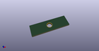
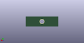
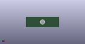

# OOMP Footprint  
## PanelHole_ToggleSwitch_NKK_A12  by AkiyukiOkayasu  
  
oomp key: oomp_akiyukiokayasu_kicad_akiyuki_footprint_panelhole_toggleswitch_nkk_a12  
  
source repo at: [http://github.com/AkiyukiOkayasu/Kicad_Akiyuki_Footprint.pretty/blob/master/tmp/data/oomlout_oomp_footprint_src/USB_MicroB_PowerOnly.kicad_mod](http://github.com/AkiyukiOkayasu/Kicad_Akiyuki_Footprint.pretty/blob/master/tmp/data/oomlout_oomp_footprint_src/USB_MicroB_PowerOnly.kicad_mod)  
## Footprint  
  
  
  
  
| name | value | 
| --- | --- | 
| footprint name | PanelHole_ToggleSwitch_NKK_A12 | 
| footprint description | Mounting Hole for NKK A12 series toggle switch | 
| number of pads | 1 | 
| github path | http://github.com/AkiyukiOkayasu/Kicad_Akiyuki_Footprint.pretty/blob/master/tmp/data/oomlout_oomp_footprint_src/PanelHole_ToggleSwitch_NKK_A12.kicad_mod | 
| oomp key | oomp_akiyukiokayasu_kicad_akiyuki_footprint_panelhole_toggleswitch_nkk_a12 | 
| oomp bot github | https://github.com/oomlout/oomlout_oomp_footprint_bot/tree/main/tmp/data/oomlout_oomp_footprint_src/footprints/akiyukiokayasu_kicad_akiyuki_footprint_panelhole_toggleswitch_nkk_a12/working | 
## Images  
  
  
  
  
  
  
