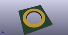

# OOMP Footprint  
## PanelHole_TRS  by none  
  
oomp key: oomp_akiyukiokayasu_kicad_akiyuki_footprint_panelhole_trs  
  
source repo at: [http://gitlab.com/AkiyukiOkayasu/Kicad_Akiyuki_Footprint.pretty/blob/master/tmp/data//oomlout_oomp_footprint_src/USB_MicroB_PowerOnly.kicad_mod](http://gitlab.com/AkiyukiOkayasu/Kicad_Akiyuki_Footprint.pretty/blob/master/tmp/data//oomlout_oomp_footprint_src/USB_MicroB_PowerOnly.kicad_mod)  
## Footprint  
  
  
  
  
| name | value | 
| --- | --- | 
| footprint name | PanelHole_TRS | 
| footprint description | Mounting Hole TRS jack | 
| number of pads | 1 | 
| github path | http://github.com/AkiyukiOkayasu/Kicad_Akiyuki_Footprint.pretty/blob/master/tmp/data//oomlout_oomp_footprint_src/PanelHole_TRS.kicad_mod | 
| oomp key | oomp_akiyukiokayasu_kicad_akiyuki_footprint_panelhole_trs | 
| oomp bot github | https://github.com/oomlout/oomlout_oomp_footprint_bot/tree/main/tmp/data//oomlout_oomp_footprint_src/footprints/akiyukiokayasu_kicad_akiyuki_footprint_panelhole_trs/working | 
## Images  
  
  
  
  
  
  
  
  
