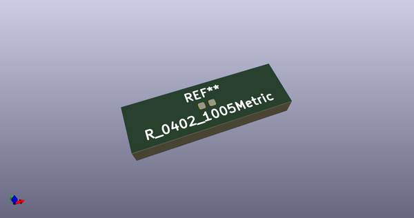
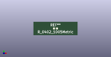

# OOMP Footprint  
## R_0402_1005Metric  by none  
  
oomp key: oomp_akiyukiokayasu_kicad_akiyuki_footprint_r_0402_1005metric  
  
source repo at: [http://gitlab.com/AkiyukiOkayasu/Kicad_Akiyuki_Footprint.pretty/blob/master/tmp/data//oomlout_oomp_footprint_src/USB_MicroB_PowerOnly.kicad_mod](http://gitlab.com/AkiyukiOkayasu/Kicad_Akiyuki_Footprint.pretty/blob/master/tmp/data//oomlout_oomp_footprint_src/USB_MicroB_PowerOnly.kicad_mod)  
## Footprint  
  
  
  
  
| name | value | 
| --- | --- | 
| footprint name | R_0402_1005Metric | 
| footprint description | Resistor SMD 0402 (1005 Metric), square (rectangular) end terminal, IPC_7351 nominal, (Body size source: http://www.tortai-tech.com/upload/download/2011102023233369053.pdf), generated with kicad-footprint-generator | 
| number of pads | 4 | 
| github path | http://github.com/AkiyukiOkayasu/Kicad_Akiyuki_Footprint.pretty/blob/master/tmp/data//oomlout_oomp_footprint_src/R_0402_1005Metric.kicad_mod | 
| oomp key | oomp_akiyukiokayasu_kicad_akiyuki_footprint_r_0402_1005metric | 
| oomp bot github | https://github.com/oomlout/oomlout_oomp_footprint_bot/tree/main/tmp/data//oomlout_oomp_footprint_src/footprints/akiyukiokayasu_kicad_akiyuki_footprint_r_0402_1005metric/working | 
## Images  
  
  
  
  
  
  
