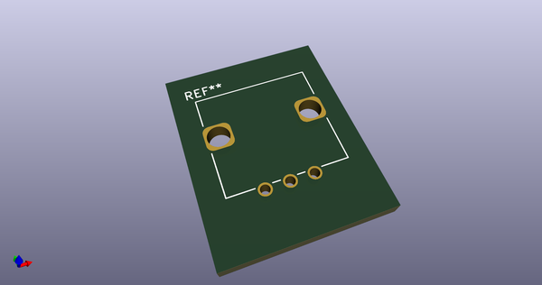
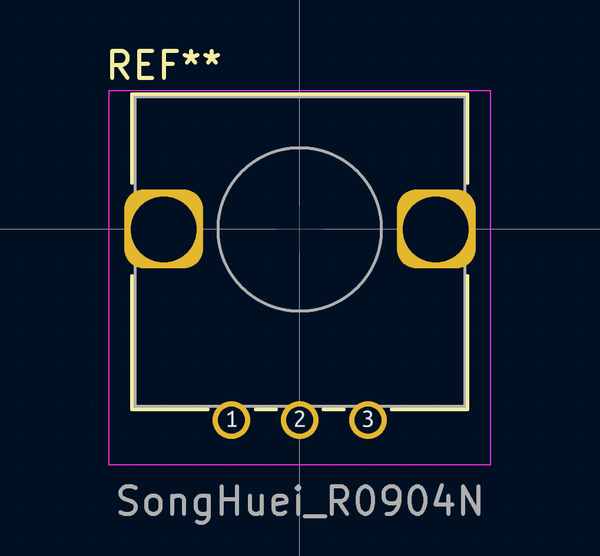
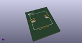
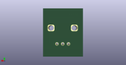
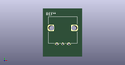

# OOMP Footprint  
## SongHuei_R0904N  by AkiyukiOkayasu  
  
oomp key: oomp_akiyukiokayasu_kicad_akiyuki_footprint_songhuei_r0904n  
  
source repo at: [http://github.com/AkiyukiOkayasu/Kicad_Akiyuki_Footprint.pretty/blob/master/tmp/data/oomlout_oomp_footprint_src/USB_MicroB_PowerOnly.kicad_mod](http://github.com/AkiyukiOkayasu/Kicad_Akiyuki_Footprint.pretty/blob/master/tmp/data/oomlout_oomp_footprint_src/USB_MicroB_PowerOnly.kicad_mod)  
## Footprint  
  
  
  
  
| name | value | 
| --- | --- | 
| footprint name | SongHuei_R0904N | 
| footprint description | Potentiometer, vertical, Alps RK09L Single, http://www.alps.com/prod/info/E/HTML/Potentiometer/RotaryPotentiometers/RK09L/RK09L_list.html | 
| number of pads | 5 | 
| github path | http://github.com/AkiyukiOkayasu/Kicad_Akiyuki_Footprint.pretty/blob/master/tmp/data/oomlout_oomp_footprint_src/SongHuei_R0904N.kicad_mod | 
| oomp key | oomp_akiyukiokayasu_kicad_akiyuki_footprint_songhuei_r0904n | 
| oomp bot github | https://github.com/oomlout/oomlout_oomp_footprint_bot/tree/main/tmp/data/oomlout_oomp_footprint_src/footprints/akiyukiokayasu_kicad_akiyuki_footprint_songhuei_r0904n/working | 
## Images  
  
  
  
  
  
  
