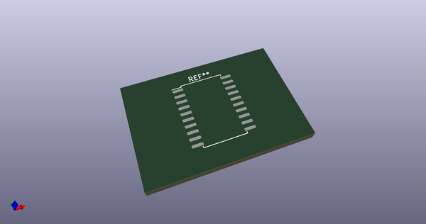
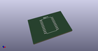

# OOMP Footprint  
## SOP-20_7.5x12.8mm_P1.27mm  by AkiyukiOkayasu  
  
oomp key: oomp_akiyukiokayasu_kicad_akiyuki_footprint_sop_20_7_5x12_8mm_p1_27mm  
  
source repo at: [http://github.com/AkiyukiOkayasu/Kicad_Akiyuki_Footprint.pretty/blob/master/tmp/data/oomlout_oomp_footprint_src/USB_MicroB_PowerOnly.kicad_mod](http://github.com/AkiyukiOkayasu/Kicad_Akiyuki_Footprint.pretty/blob/master/tmp/data/oomlout_oomp_footprint_src/USB_MicroB_PowerOnly.kicad_mod)  
## Footprint  
  
  
  
  
| name | value | 
| --- | --- | 
| footprint name | SOP-20_7.5x12.8mm_P1.27mm | 
| footprint description | SOP, 20 Pin (http://www.issi.com/WW/pdf/31FL3218.pdf#page=14), generated with kicad-footprint-generator ipc_gullwing_generator.py | 
| number of pads | 20 | 
| github path | http://github.com/AkiyukiOkayasu/Kicad_Akiyuki_Footprint.pretty/blob/master/tmp/data/oomlout_oomp_footprint_src/SOP-20_7.5x12.8mm_P1.27mm.kicad_mod | 
| oomp key | oomp_akiyukiokayasu_kicad_akiyuki_footprint_sop_20_7_5x12_8mm_p1_27mm | 
| oomp bot github | https://github.com/oomlout/oomlout_oomp_footprint_bot/tree/main/tmp/data/oomlout_oomp_footprint_src/footprints/akiyukiokayasu_kicad_akiyuki_footprint_sop_20_7_5x12_8mm_p1_27mm/working | 
## Images  
  
  
  
  
  
  
  
  
