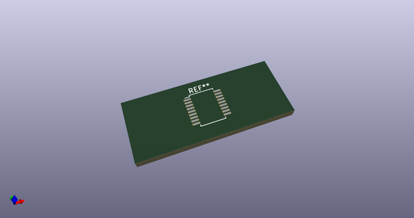
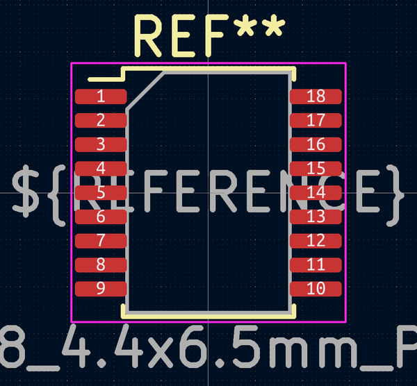
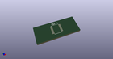

# OOMP Footprint  
## SSOP-18_4.4x6.5mm_P0.65mm_HandSolder  by AkiyukiOkayasu  
  
oomp key: oomp_akiyukiokayasu_kicad_akiyuki_footprint_ssop_18_4_4x6_5mm_p0_65mm_handsolder  
  
source repo at: [http://github.com/AkiyukiOkayasu/Kicad_Akiyuki_Footprint.pretty/blob/master/tmp/data/oomlout_oomp_footprint_src/USB_MicroB_PowerOnly.kicad_mod](http://github.com/AkiyukiOkayasu/Kicad_Akiyuki_Footprint.pretty/blob/master/tmp/data/oomlout_oomp_footprint_src/USB_MicroB_PowerOnly.kicad_mod)  
## Footprint  
  
  
  
  
| name | value | 
| --- | --- | 
| footprint name | SSOP-18_4.4x6.5mm_P0.65mm_HandSolder | 
| footprint description | SSOP18: plastic shrink small outline package; 18 leads; body width 4.4 mm (http://toshiba.semicon-storage.com/info/docget.jsp?did=30523&prodName=TBD62783APG) | 
| number of pads | 18 | 
| github path | http://github.com/AkiyukiOkayasu/Kicad_Akiyuki_Footprint.pretty/blob/master/tmp/data/oomlout_oomp_footprint_src/SSOP-18_4.4x6.5mm_P0.65mm_HandSolder.kicad_mod | 
| oomp key | oomp_akiyukiokayasu_kicad_akiyuki_footprint_ssop_18_4_4x6_5mm_p0_65mm_handsolder | 
| oomp bot github | https://github.com/oomlout/oomlout_oomp_footprint_bot/tree/main/tmp/data/oomlout_oomp_footprint_src/footprints/akiyukiokayasu_kicad_akiyuki_footprint_ssop_18_4_4x6_5mm_p0_65mm_handsolder/working | 
## Images  
  
  
  
  
  
  
  
  
