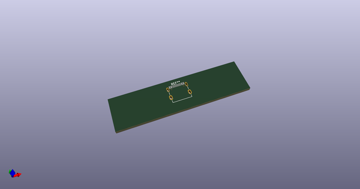
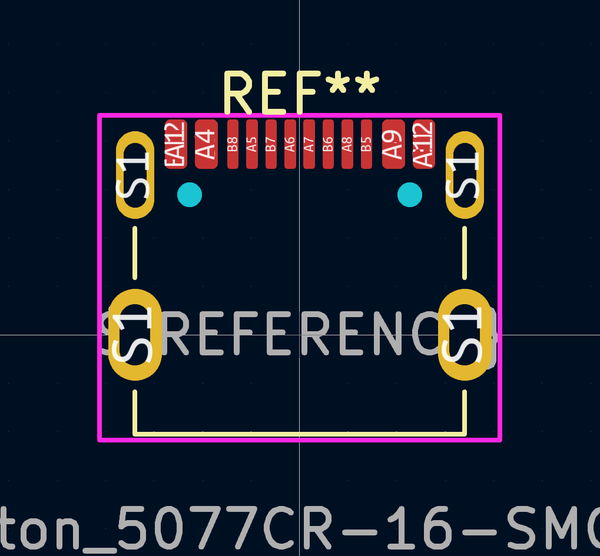
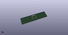
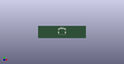

# OOMP Footprint  
## USB_C_Receptacle_Nelton_5077CR-16-SMC2-BK-TR_HandSolder  by AkiyukiOkayasu  
  
oomp key: oomp_akiyukiokayasu_kicad_akiyuki_footprint_usb_c_receptacle_nelton_5077cr_16_smc2_bk_tr_handsolder  
  
source repo at: [http://github.com/AkiyukiOkayasu/Kicad_Akiyuki_Footprint.pretty/blob/master/tmp/data//oomlout_oomp_footprint_src/USB_MicroB_PowerOnly.kicad_mod](http://github.com/AkiyukiOkayasu/Kicad_Akiyuki_Footprint.pretty/blob/master/tmp/data//oomlout_oomp_footprint_src/USB_MicroB_PowerOnly.kicad_mod)  
## Footprint  
  
  
  
  
| name | value | 
| --- | --- | 
| footprint name | USB_C_Receptacle_Nelton_5077CR-16-SMC2-BK-TR_HandSolder | 
| footprint description | USB Type-C receptacle for USB 2.0 and PD, http://www.krhro.com/uploads/soft/180320/1-1P320120243.pdf | 
| number of pads | 22 | 
| github path | http://github.com/AkiyukiOkayasu/Kicad_Akiyuki_Footprint.pretty/blob/master/tmp/data//oomlout_oomp_footprint_src/USB_C_Receptacle_Nelton_5077CR-16-SMC2-BK-TR_HandSolder.kicad_mod | 
| oomp key | oomp_akiyukiokayasu_kicad_akiyuki_footprint_usb_c_receptacle_nelton_5077cr_16_smc2_bk_tr_handsolder | 
| oomp bot github | https://github.com/oomlout/oomlout_oomp_footprint_bot/tree/main/tmp/data//oomlout_oomp_footprint_src/footprints/akiyukiokayasu_kicad_akiyuki_footprint_usb_c_receptacle_nelton_5077cr_16_smc2_bk_tr_handsolder/working | 
## Images  
  
  
  
  
  
  
  
  
