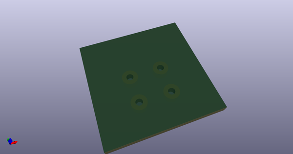
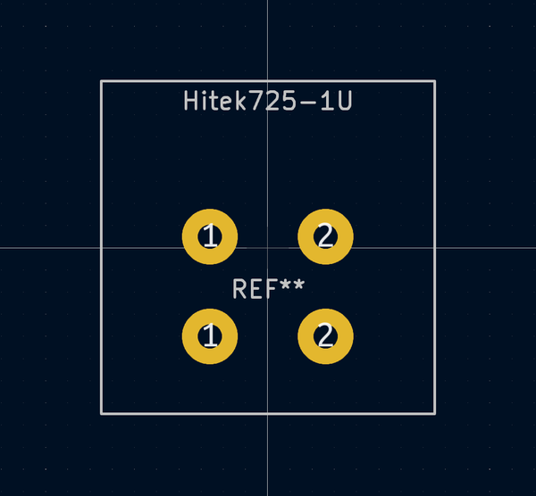
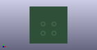

# OOMP Footprint  
## Hitek725-1U  by Alasofia  
  
oomp key: oomp_alasofia_hitek725_hitek725_1u  
  
source repo at: [http://github.com/Alasofia/hitek725.pretty/blob/master/tmp/data//oomlout_oomp_footprint_src/Hitek725-BigAssEnter.kicad_mod](http://github.com/Alasofia/hitek725.pretty/blob/master/tmp/data//oomlout_oomp_footprint_src/Hitek725-BigAssEnter.kicad_mod)  
## Footprint  
  
  
  
  
| name | value | 
| --- | --- | 
| footprint name | Hitek725-1U | 
| footprint description | None | 
| number of pads | 4 | 
| github path | http://github.com/Alasofia/hitek725.pretty/blob/master/tmp/data//oomlout_oomp_footprint_src/Hitek725-1U.kicad_mod | 
| oomp key | oomp_alasofia_hitek725_hitek725_1u | 
| oomp bot github | https://github.com/oomlout/oomlout_oomp_footprint_bot/tree/main/tmp/data//oomlout_oomp_footprint_src/footprints/alasofia_hitek725_hitek725_1u/working | 
## Images  
  
  
  
  
  
  
  
  
